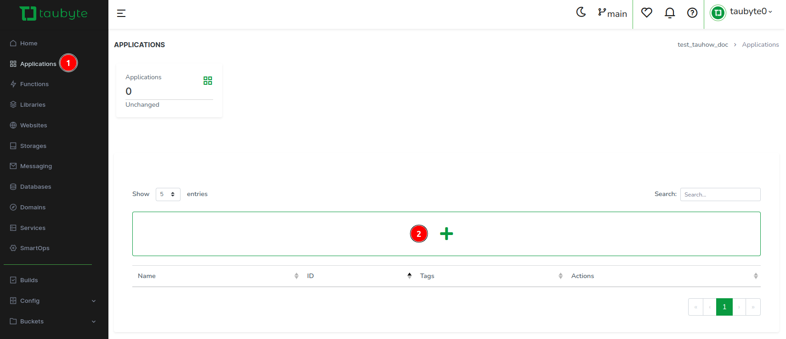
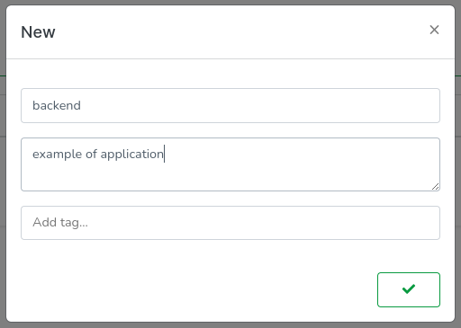
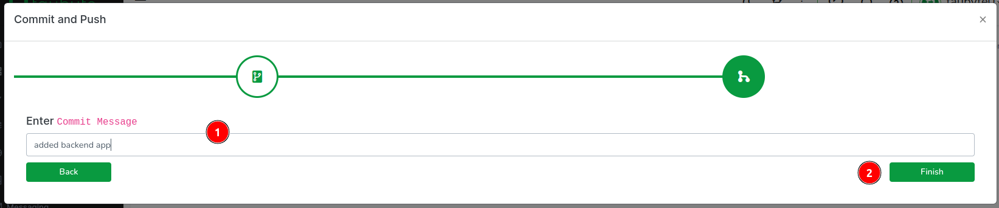
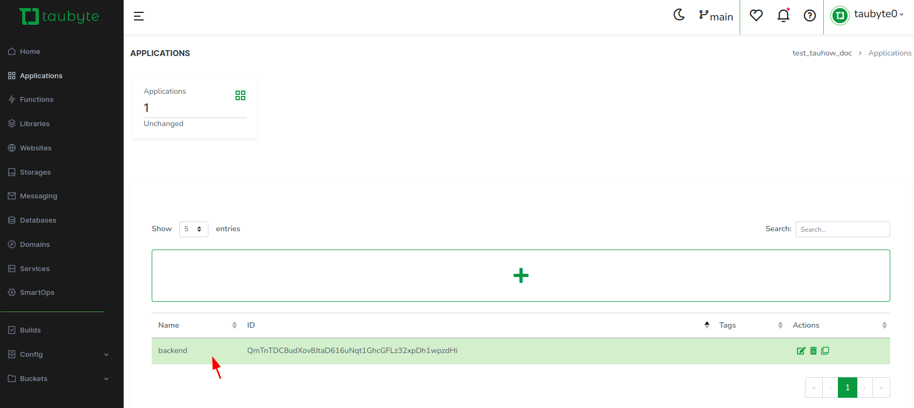
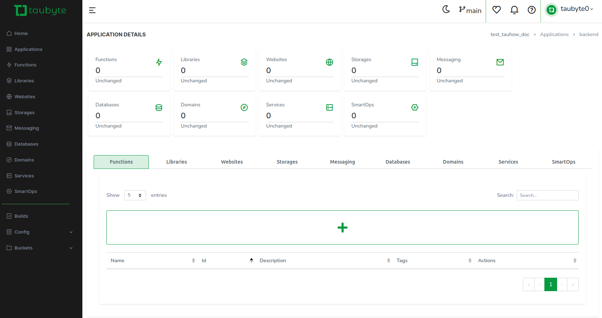
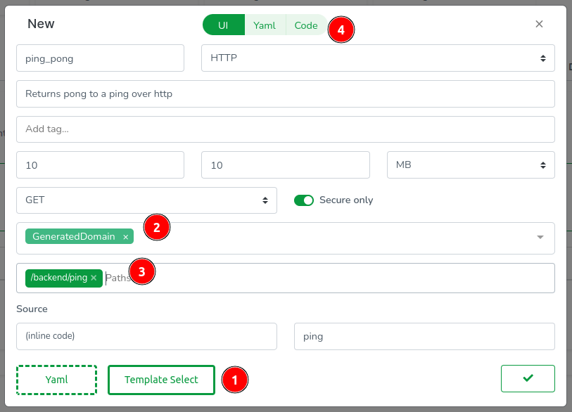
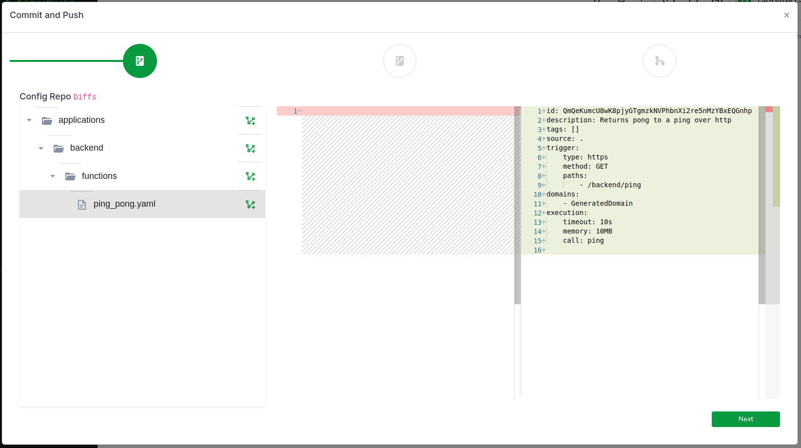

# Applications

<!-- Source: https://tau.how/development/applications/ -->

Applications in Taubyte provide a way to organize and manage related resources within a project. They enable better structure, granular access control, and logical separation of functionality while maintaining access to both application-specific and global resources.

## Understanding Applications

### What are Applications?

Applications are organizational containers within a Taubyte project that group related resources together. Each application can have its own:

- **Functions**: Application-specific serverless functions
- **Websites**: Dedicated web properties
- **Databases**: Isolated data storage with application-specific settings
- **Storage**: Application-scoped file storage
- **Messaging**: Private pub/sub channels
- **Libraries**: Shared code libraries

### Global vs Application Scope

**Global Scope (Default):**

- Resources accessible throughout the entire project
- Shared across all applications
- Used for common infrastructure and shared services

**Application Scope:**

- Resources specific to an application
- Isolated from other applications
- Can access both application and global resources

## Creating Applications

### Using the Web Console

1. Navigate to `Applications` in the side menu
2. Click the `+` button to create a new application



3. Configure application properties:
   - **Name**: Application identifier (e.g., `backend`, `frontend`, `api`)
   - **Description**: Purpose and functionality description



4. Push configuration changes to apply



### Application Structure

Once created, applications appear in the project structure:

```
project/
├── global/                  # Global resources
│   ├── functions/
│   ├── websites/
│   └── databases/
└── applications/
    ├── backend/            # Backend application
    │   ├── functions/
    │   ├── databases/
    │   └── messaging/
    └── frontend/           # Frontend application
        ├── websites/
        ├── storage/
        └── functions/
```

## Working with Applications

### Opening Applications

1. Navigate to the `Applications` section
2. Click on the application name to enter its scope



3. The interface switches to application-specific views



### Creating Resources within Applications

Once inside an application, create resources as you would globally:

#### Application-Specific Function

1. Within the application, go to `Functions` → click `+`
2. Configure function properties:
   - Functions inherit application context
   - Paths don't need to include application name
   - Access to both application and global resources



#### Example Function Configuration

```yaml
# Function in "backend" application
name: api-handler
description: Backend API handler
path: /api/users # Simple path, no application prefix needed
domains:
  - GeneratedDomain
memory: 50MB
timeout: 10s
```

#### Code Organization

Application functions are organized separately:



**Configuration Path:** `applications/backend/functions/api-handler.yaml`

**Code Path:** `applications/backend/code/api-handler/`

## Use Cases and Patterns

### Multi-Service Architecture

#### Backend Application

```yaml
# applications/backend/functions/api.yaml
name: api-server
description: Main API server
paths:
  - /api/*
domains:
  - api.myapp.com
```

```yaml
# applications/backend/databases/userdata.yaml
name: user-database
description: User data storage
matcher: /backend/users
size: 1GB
replication:
  min: 2
  max: 3
```

#### Frontend Application

```yaml
# applications/frontend/websites/webapp.yaml
name: web-app
description: Main web application
domains:
  - myapp.com
  - www.myapp.com
paths:
  - /
```

```yaml
# applications/frontend/storage/assets.yaml
name: static-assets
description: Static web assets
matcher: /frontend/assets
size: 500MB
```

### Microservices Pattern

#### User Service

```yaml
# applications/user-service/functions/
├── register.yaml
├── login.yaml
├── profile.yaml
└── settings.yaml
```

```yaml
# applications/user-service/databases/
├── users.yaml
├── sessions.yaml
└── preferences.yaml
```

#### Payment Service

```yaml
# applications/payment-service/functions/
├── charge.yaml
├── refund.yaml
└── webhook.yaml
```

```yaml
# applications/payment-service/databases/
├── transactions.yaml
└── invoices.yaml
```

### Multi-Tenant Applications

#### Per-Tenant Applications

```yaml
# applications/tenant-a/
├── functions/
├── databases/
└── storage/

# applications/tenant-b/
├── functions/
├── databases/
└── storage/
```

#### Shared Services

```yaml
# global/functions/
├── auth.yaml          # Shared authentication
├── analytics.yaml     # Shared analytics
└── notifications.yaml # Shared notifications
```

## Resource Access Patterns

### Application-to-Application Communication

Applications can communicate through:

#### Shared Global Resources

```go
// Function in any application accessing global database
db, err := database.New("/global/shared-cache")
```

#### HTTP Communication

```go
// Backend application calling frontend API
resp, err := http.Get("https://api.myapp.com/internal/data")
```

#### Pub/Sub Messaging

```go
// Cross-application messaging
channel, err := pubsub.Channel("app-notifications")
err = channel.Publish([]byte("message from backend"))
```

### Resource Isolation

Application resources are isolated by default:

```go
// This database is specific to the current application
db, err := database.New("/user-data")

// This storage is application-scoped
storage, err := storage.New("/app-files")
```

### Accessing Global Resources

```go
// Access global resources from within applications
globalDB, err := database.New("/global/shared-data")
globalStorage, err := storage.New("/global/assets")
```

## Access Control and Security

### Application-Level Permissions

Applications provide granular access control:

#### Repository Permissions

Each application can have separate repository permissions:

- **Configuration Repository**: Controls who can modify application settings
- **Code Repository**: Controls who can modify application code
- **Library Access**: Controls which libraries the application can use

#### Resource Isolation

Applications provide natural security boundaries:

- **Data Isolation**: Application databases are separate
- **Code Isolation**: Application code is in separate repositories
- **Access Isolation**: Different teams can manage different applications

### Team Organization

#### Development Teams

```yaml
# Backend team manages backend application
applications/backend/
├── owners: [backend-team@company.com]
├── contributors: [dev-team@company.com]
└── readers: [qa-team@company.com]

# Frontend team manages frontend application
applications/frontend/
├── owners: [frontend-team@company.com]
├── contributors: [design-team@company.com]
└── readers: [qa-team@company.com]
```

## Configuration Management

### Application-Specific Configuration

Different applications can have different configurations:

#### Development Configuration

```yaml
# applications/backend/config/development.yaml
environment:
  - LOG_LEVEL: debug
  - API_TIMEOUT: 30s
  - DB_POOL_SIZE: 5

resources:
  default_memory: 50MB
  default_timeout: 30s
```

#### Production Configuration

```yaml
# applications/backend/config/production.yaml
environment:
  - LOG_LEVEL: warn
  - API_TIMEOUT: 10s
  - DB_POOL_SIZE: 20

resources:
  default_memory: 200MB
  default_timeout: 10s
```

### Environment-Specific Applications

```yaml
# applications/backend-dev/     # Development backend
# applications/backend-prod/    # Production backend
# applications/frontend-staging/ # Staging frontend
```

## Deployment Strategies

### Independent Deployment

Applications can be deployed independently:

```bash
# Deploy only backend application
tau deploy --application backend

# Deploy only frontend application
tau deploy --application frontend

# Deploy all applications
tau deploy --all
```

### Coordinated Deployment

For interdependent applications:

```bash
# Deploy in specific order
tau deploy --application backend --wait
tau deploy --application frontend --wait
tau deploy --application monitoring
```

### Rollback by Application

```bash
# Rollback specific application
tau rollback --application backend --version v1.2.3

# Rollback all applications
tau rollback --all --version v1.2.3
```

## Monitoring and Debugging

### Application-Specific Monitoring

Monitor applications independently:

```bash
# Monitor backend application
tau logs --application backend

# Monitor frontend application
tau logs --application frontend

# Monitor all applications
tau logs --all
```

### Performance Metrics

```bash
# Application-specific metrics
tau metrics --application backend --metric cpu
tau metrics --application frontend --metric requests

# Cross-application metrics
tau metrics --compare backend,frontend --metric memory
```

### Health Checks

```bash
# Application health
tau health --application backend
tau health --application frontend

# Overall project health
tau health --all
```

## Best Practices

### Organization

- **Logical Grouping**: Group related functionality into applications
- **Clear Boundaries**: Define clear boundaries between applications
- **Consistent Naming**: Use consistent naming conventions
- **Documentation**: Document application purposes and dependencies

### Security

- **Principle of Least Privilege**: Give applications minimal required permissions
- **Data Isolation**: Keep sensitive data in appropriate applications
- **Access Reviews**: Regularly review application access permissions
- **Audit Logging**: Monitor cross-application access

### Development

- **Independent Development**: Enable teams to work independently
- **Shared Resources**: Use global resources for truly shared functionality
- **Testing Isolation**: Test applications in isolation when possible
- **Dependency Management**: Clearly define inter-application dependencies

### Performance

- **Resource Allocation**: Allocate resources based on application needs
- **Scaling**: Scale applications independently based on load
- **Monitoring**: Monitor applications separately for better insights
- **Optimization**: Optimize each application for its specific use case

Applications provide a powerful way to organize complex Taubyte projects, enabling better team collaboration, security, and maintainability while preserving the flexibility to share resources when needed.
