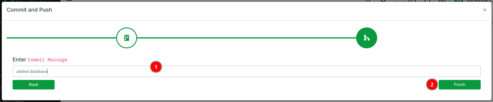

# Databases

Taubyte provides a distributed key-value database system that automatically replicates across nodes and scales with your application. Unlike traditional SQL databases, Taubyte databases are created on-demand and accessed through a simple key-value interface.

## Database Characteristics

### Key-Value Store

- **Simple Interface**: Put, Get, Delete, and List operations
- **No Schema**: Store any data structure as values
- **Binary Safe**: Store text, JSON, images, or any binary data
- **Path-based Keys**: Organize data using hierarchical keys like `/users/123/profile`

### Distributed Architecture

- **Automatic Replication**: Data replicated across multiple nodes
- **High Availability**: Continues operating even if some nodes fail
- **Eventual Consistency**: All replicas converge to the same state
- **Global Distribution**: Data available worldwide with low latency

### Dynamic Creation

- **On-Demand Instantiation**: Databases created when first accessed
- **Regex Matchers**: Use patterns to create isolated databases per user/tenant
- **No Pre-provisioning**: No need to create databases before use

## Creating Databases

### Using the Web Console

1. Navigate to `Database` in the side menu and click the `+` button


2. Configure your database:
   - **Name**: `example_kv_store` (descriptive name)
   - **Matcher**: `/example/kv` (path pattern for database access)
   - **Replication**: `min=1, max=2` (replication settings)
   - **Size**: `100MB` (storage limit)


3. Push the configuration changes



### Database Configuration

Databases are configured through YAML:

```yaml
id: ""
description: Key-value storage for application data
tags: []
matcher: /example/kv
replication:
  min: 1
  max: 2
size: 100MB
```

#### Configuration Options

**Matcher Patterns:**

- **Simple Path**: `/example/kv` - Single database
- **Regex Pattern**: `/profile/history/[^/]+` - Database per user
- **Wildcard**: `/data/*` - Multiple isolated databases

**Replication Settings:**

- `min`: Minimum number of replicas
- `max`: Maximum number of replicas
- Higher replication increases availability but uses more storage

**Size Limits:**

- Set appropriate limits based on expected data volume
- Can be increased later if needed

## Using Databases

### Basic Operations

#### Creating a Connection

```go
import "github.com/taubyte/go-sdk/database"

// Open database (creates if doesn't exist)
db, err := database.New("/example/kv")
if err != nil {
    return handleError(err)
}
defer db.Close()
```

#### Storing Data

```go
// Store string data
err = db.Put("/user/123", []byte("John Doe"))
if err != nil {
    return handleError(err)
}

// Store JSON data
user := map[string]string{
    "name": "John Doe",
    "email": "john@example.com",
}
jsonData, _ := json.Marshal(user)
err = db.Put("/user/123/profile", jsonData)
```

#### Retrieving Data

```go
// Get data by key
data, err := db.Get("/user/123")
if err != nil {
    return handleError(err)
}

// Parse JSON data
var user map[string]string
err = json.Unmarshal(data, &user)
if err != nil {
    return handleError(err)
}
```

#### Deleting Data

```go
// Delete specific key
err = db.Delete("/user/123")
if err != nil {
    return handleError(err)
}
```

#### Listing Keys

```go
// List all keys with prefix
keys, err := db.List("/user/")
if err != nil {
    return handleError(err)
}

// Process each key
for _, key := range keys {
    fmt.Println("Found key:", key)
}
```

## Complete Examples

### Setting Key-Value Pairs

```go
package lib

import (
    "encoding/json"
    "github.com/taubyte/go-sdk/database"
    "github.com/taubyte/go-sdk/event"
    http "github.com/taubyte/go-sdk/http/event"
)

type SetRequest struct {
    Key   string `json:"key"`
    Value string `json:"value"`
}

func handleError(h http.Event, err error, code int) uint32 {
    h.Write([]byte(err.Error()))
    h.Return(code)
    return 1
}

//export setValue
func setValue(e event.Event) uint32 {
    h, err := e.HTTP()
    if err != nil {
        return 1
    }

    // Open database
    db, err := database.New("/example/kv")
    if err != nil {
        return handleError(h, err, 500)
    }
    defer db.Close()

    // Parse request body
    var req SetRequest
    decoder := json.NewDecoder(h.Body())
    err = decoder.Decode(&req)
    if err != nil {
        return handleError(h, err, 400)
    }

    // Store key-value pair
    err = db.Put(req.Key, []byte(req.Value))
    if err != nil {
        return handleError(h, err, 500)
    }

    // Return success
    h.Write([]byte("Value stored successfully"))
    h.Return(200)
    return 0
}
```

### Getting Values by Key

```go
//export getValue
func getValue(e event.Event) uint32 {
    h, err := e.HTTP()
    if err != nil {
        return 1
    }

    // Get key from query parameter
    key, err := h.Query().Get("key")
    if err != nil {
        return handleError(h, err, 400)
    }

    // Open database
    db, err := database.New("/example/kv")
    if err != nil {
        return handleError(h, err, 500)
    }
    defer db.Close()

    // Get value
    value, err := db.Get(key)
    if err != nil {
        return handleError(h, err, 404)
    }

    // Return value
    h.Write(value)
    h.Return(200)
    return 0
}
```

### User Profile Management

```go
type UserProfile struct {
    ID       string `json:"id"`
    Name     string `json:"name"`
    Email    string `json:"email"`
    Created  int64  `json:"created"`
}

//export createUserProfile
func createUserProfile(e event.Event) uint32 {
    h, err := e.HTTP()
    if err != nil {
        return 1
    }

    // Parse user data
    var profile UserProfile
    decoder := json.NewDecoder(h.Body())
    err = decoder.Decode(&profile)
    if err != nil {
        return handleError(h, err, 400)
    }

    // Set creation timestamp
    profile.Created = time.Now().Unix()

    // Serialize profile
    profileData, err := json.Marshal(profile)
    if err != nil {
        return handleError(h, err, 500)
    }

    // Store in database
    db, err := database.New("/users")
    if err != nil {
        return handleError(h, err, 500)
    }
    defer db.Close()

    key := fmt.Sprintf("/profile/%s", profile.ID)
    err = db.Put(key, profileData)
    if err != nil {
        return handleError(h, err, 500)
    }

    // Return created profile
    h.Headers().Set("Content-Type", "application/json")
    h.Write(profileData)
    h.Return(201)
    return 0
}
```

## Advanced Patterns

### Multi-Tenant Databases

Use regex matchers for per-user databases:

```yaml
matcher: /tenant/[^/]+/data
```

```go
// Each tenant gets their own database
tenantID := "company123"
db, err := database.New(fmt.Sprintf("/tenant/%s/data", tenantID))
```

### Hierarchical Data Organization

Organize data using path-like keys:

```go
// Store user data hierarchically
db.Put("/users/123/profile", profileData)
db.Put("/users/123/preferences", prefsData)
db.Put("/users/123/sessions/456", sessionData)

// List all user sessions
sessions, err := db.List("/users/123/sessions/")
```

### Caching Patterns

Use databases for application caching:

```go
//export getCachedData
func getCachedData(e event.Event) uint32 {
    // Try cache first
    cache, _ := database.New("/cache")
    defer cache.Close()

    cacheKey := "/api/expensive-operation"
    cached, err := cache.Get(cacheKey)
    if err == nil {
        // Return cached result
        h.Write(cached)
        return 0
    }

    // Compute result and cache it
    result := expensiveOperation()
    cache.Put(cacheKey, result)

    h.Write(result)
    return 0
}
```

## Data Modeling Best Practices

### Key Design

- **Use hierarchical paths**: `/users/123/orders/456`
- **Include type information**: `/product:123` vs `/user:123`
- **Use consistent naming**: snake_case or camelCase
- **Avoid deep nesting**: Keep paths reasonable in length

### Value Storage

- **Store JSON for structured data**: Easy to parse and modify
- **Use binary for large objects**: Images, files, etc.
- **Compress large values**: Reduce storage and transfer costs
- **Version your data structures**: Plan for schema evolution

### Performance Optimization

- **Batch operations**: Group multiple puts/gets when possible
- **Use appropriate key prefixes**: For efficient listing
- **Implement local caching**: Reduce database calls
- **Monitor key distribution**: Avoid hotspots

## Testing Database Operations

### Local Testing

```bash
# Set a value
curl -X POST http://localhost:PORT/api/kv \
  -H "Content-Type: application/json" \
  -d '{"key": "test", "value": "hello world"}'

# Get a value
curl "http://localhost:PORT/api/kv?key=test"
```

### Integration Testing

```go
// Test database operations
func testDatabase() {
    db, err := database.New("/test")
    if err != nil {
        panic(err)
    }
    defer db.Close()

    // Test put
    err = db.Put("/test/key", []byte("test value"))
    assert.NoError(err)

    // Test get
    value, err := db.Get("/test/key")
    assert.NoError(err)
    assert.Equal("test value", string(value))

    // Test delete
    err = db.Delete("/test/key")
    assert.NoError(err)
}
```

## Troubleshooting

### Common Issues

**Database connection errors:**

- Verify matcher pattern is correct
- Check database configuration is deployed
- Ensure function has proper error handling

**Data not found:**

- Verify key exists using List operation
- Check for typos in key names
- Ensure database path matches configuration

**Replication issues:**

- Check cluster health and node availability
- Verify replication settings are appropriate
- Monitor network connectivity between nodes

### Monitoring and Debugging

- Use `fmt.Printf` for local debugging
- Monitor database size and performance
- Check replication status across nodes
- Implement proper error logging

Taubyte databases provide a simple yet powerful foundation for storing and retrieving data in your distributed applications, with automatic scaling and replication built-in.
