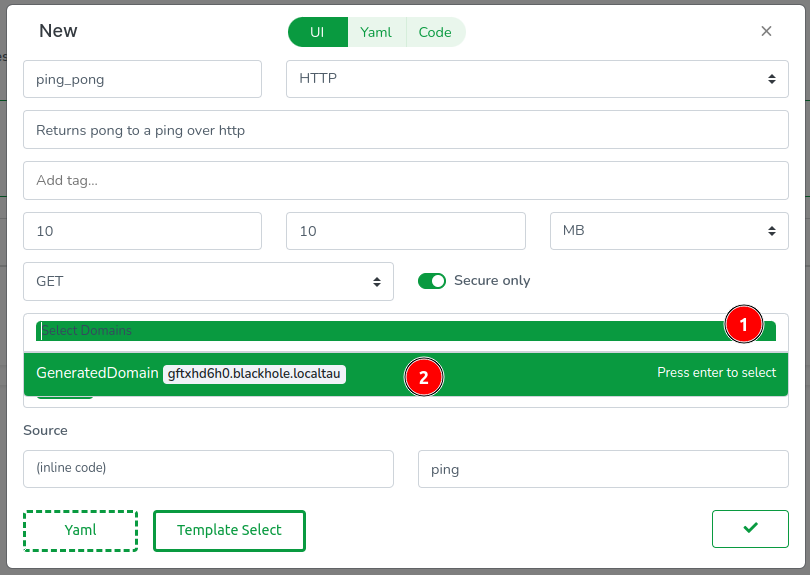
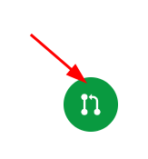
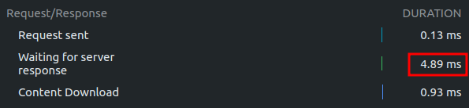

# Functions

<!-- Source: docs-old/01-dev-getting-started/03-first-function.md -->


Let's create a WebAssembly serverless function in our cloud! We'll use the Web Console to create a simple ping-pong function in Go.

### Creating the Function

Navigate to `Functions` in the side menu and click the `+` button


Instead of filling out fields manually, let's use a template. Click `Template Select`


In the template modal: Select Go as the language, choose the `ping_pong` template, and click 'Close' to exit the modal


The template fills most fields automatically. For domains, click the dropdown and select `GeneratedDomain` to create a new domain resource


### The Configuration

The Web Console clones your repos in-browser, so everything has a code representation. Click the `Yaml` tab to see the function's config:
```yaml
id: ''
description: Returns pong to a ping over HTTP
tags: []
source: .
trigger:
  type: https
  method: GET
  paths:
    - /ping
domains:
  - GeneratedDomain
execution:
  timeout: 10s
  memory: 10MB
  call: ping
```

**Notes:**
- `source: .` points to inline code, but you can also reference Git repos using `source: github.com/username/repo`
- The `trigger` section supports multiple paths and HTTP methods - useful for RESTful APIs
- Pro tip: Memory and timeout values can use any standard unit (KB, MB, GB, ms, s, m)
- The `call` field must match your exported WebAssembly function name

### The Code

Next, let's inspect the code. The Web Console features a modest code editor useful for quick inline code updates. Access it by clicking on the `Code` tab.


In the editor, you will observe (1) the usual Go files including go.mod, (2) the code for our handler function `ping`, and (3) a `.taubyte` folder defining how the function is built.


- Package Naming
    - The `main` package name is reserved for the build container
    - Use a descriptive package name for your function

- SDK Implementation (`github.com/taubyte/go-sdk`)
    - Provides the interface between your code and the VM
    - Includes optimized wrappers for common operations
    - Implements zero-copy operations for maximum performance

- TinyGo Compilation Requirements
    - Functions must be exported using `//export functionName` syntax
    - Compatible with most Go standard library functionality
    - Produces optimized WebAssembly binaries

- Event Architecture
    - Events use minimal memory with uint32 identifiers
    - Designed for efficient serverless execution
    - Optimized for high-throughput scenarios

Click `Done` to proceed.


Everything done so far is confined to a virtual filesystem in your browser. To apply these changes, we need to push them. Find the green button at the bottom right of the screen and click on it.



A modal will guide you through the code changes, starting with configuration changes. Click on the domains folder, then open the GeneratedDomain.yaml file.


Copy the FQDN generated for you as we will need it later:
```yaml
fqdn: gftxhd6h0.blackhole.localtau
```

Click on Next to review code changes.


One more click on Next takes you to the final step, where you'll (1) enter a commit message and (2) push the changes to GitHub.


In production, this push would trigger an event that your cloud would capture. However, because we're using `dream` and GitHub cannot reach your nodes directly, we run a fixture called `push-all` to emulate the git events. Switch back to your terminal and run:

```sh
dream inject push-all
```

Return to the Web Console and, on the side menu, click on `Builds`. You should see two CI/CD jobs, one for configuration and one for code.


After a few seconds, the build should complete. Click on `Refresh` if it seems delayed. Then, click on the stack icon to view the ping_pong function.


## Executing the Function

Now that our function is ready to go, let's test it out! Since we're running locally, we'll need to find the right port to send our requests to. The `substrate` node (or `gateway` if you're using one) handles HTTP traffic, so let's check its port with:
```sh
dream status substrate
```

In my case, the HTTP port is 14529.
```
┌─────────────────────┬────────┬───────┐
│ substrate@blackhole │ copies │     1 │
│                     ├────────┼───────┤
│                     │ dns    │ 14304 │
│                     ├────────┼───────┤
│                     │ http   │ 14529 │
│                     ├────────┼───────┤
│                     │ p2p    │ 14282 │
└─────────────────────┴────────┴───────┘
```

You can test the function using `curl` as follows, making sure to replace `gftxhd6h0.blackhole.localtau` with your own generated domain:
```sh
curl -H "Host: gftxhd6h0.blackhole.localtau" http://127.0.0.1:14529/ping
```

Output:
```
PONG
```

For a smoother development experience, you can add the generated domain to your hosts file. On Unix-like systems (Linux/macOS), edit `/etc/hosts`:
```sh
sudo vi /etc/hosts
```

For me the generated domain is `gftxhd6h0.blackhole.localtau`. So I add:
```
127.0.0.1 gftxhd6h0.blackhole.localtau
```

Save and exit, then run `curl` again but without the `Host` header:
```sh
curl http://gftxhd6h0.blackhole.localtau:14529/ping
```

Output:
```
PONG
```

If you've added the generated domain to your `/etc/hosts`, you can also test the function directly through the Web Console:

1. In the sidebar, click on `Functions` 
2. Find your `ping` function in the list
3. Click the thunder ⚡️ icon next to it to execute

This will open a new tab and make a request to your function's endpoint.




Congratulations! You've successfully created a (local) cloud and executed a serverless function on it!


## Troubleshooting Tips
- If the curl command fails, ensure your port number matches the `dream status substrate` output
- The Host header is only needed if you haven't added the domain to `/etc/hosts`
- If the function build fails, check the Builds tab for detailed error messages
- The `dream inject push-all` command might need to be run again if changes aren't reflecting

