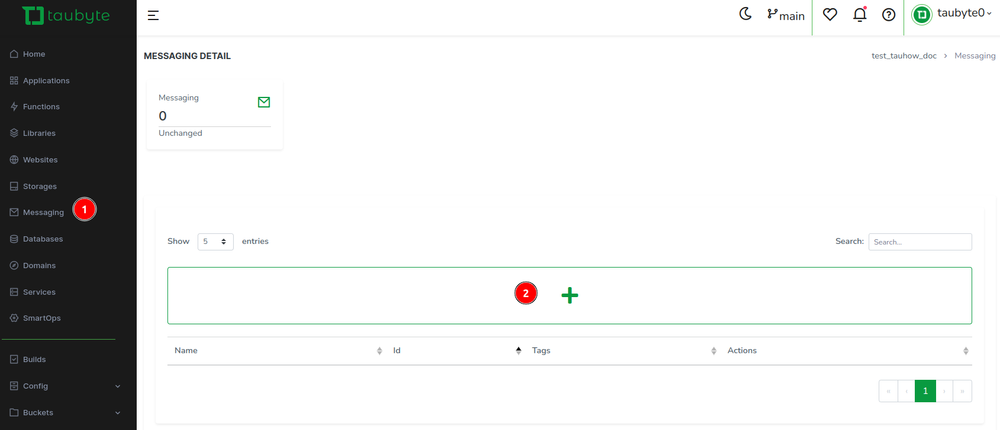
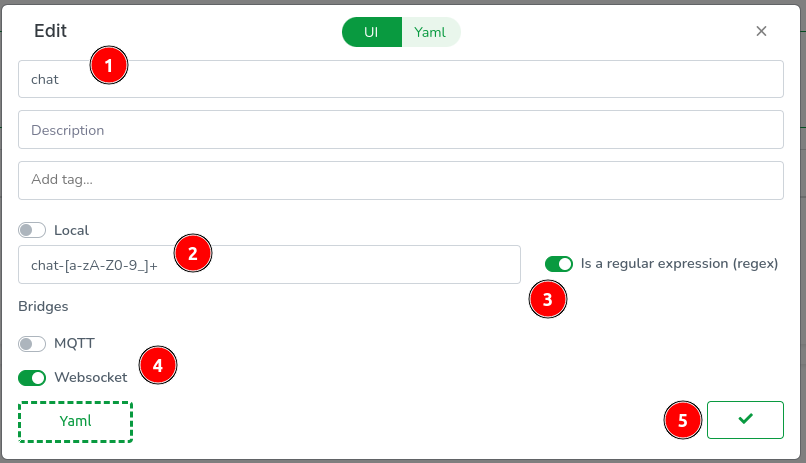
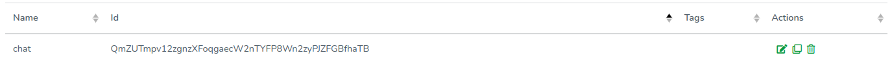
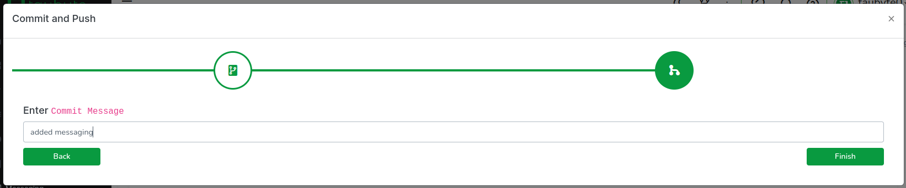
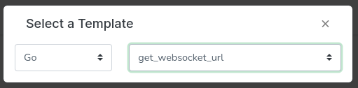
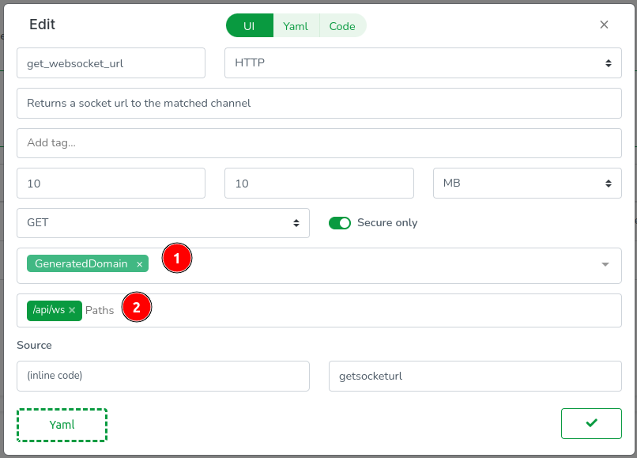
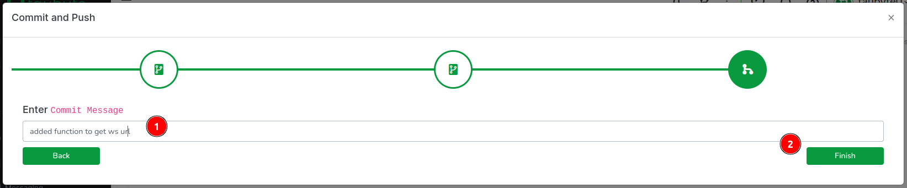
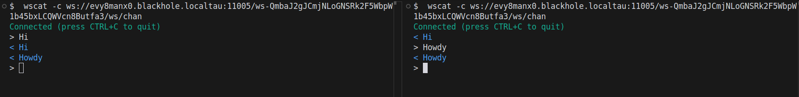

# Messaging (Pub/Sub)

<!-- Source: docs-old/01-dev-getting-started/07-create-and-use-messaging.md -->
Messaging (or Pubsub) is an important part of any distributed architecture. If you're not familiar with the other types of resources like functions and websites, I recommend you start there. With that said, let's create a messaging channel.
### Creation

Navigate to `Messaging` in the side menu and click the `+` button.



Name it `ws_chan`. Set the topic matcher to `/ws/chan`. And toggle `Websocket`. Then validate.



Once done, you should see your new it in the list.



To apply these changes to your project, click the green push button in the bottom right corner. You'll be able to review the changes, write a commit message, and push them to the repository.


### Messaging in action
Go to `Functions` and click on the `+` button. Then click on the `Template Select` button. Select `Go` and `get_websocket_url`.



Make sure domain is set to GeneratedDomain and add `/api/ws` to the path.


You can use the template code and just replace the topic. However we're going to use a query variable to create a unique channel for each room. Switch to the code view and replace the code with:
```go
package lib

import (
	"crypto/md5"
	"encoding/hex"

	"github.com/taubyte/go-sdk/event"
	http "github.com/taubyte/go-sdk/http/event"
	pubsub "github.com/taubyte/go-sdk/pubsub/node"
)

func fail(h http.Event, err error, code int) uint32 {
	h.Write([]byte(err.Error()))
	h.Return(code)
	return 1
}

//export getsocketurl
func getsocketurl(e event.Event) uint32 {
	h, err := e.HTTP()
	if err != nil {
		return 1
	}

	// get room from query
	room, err := h.Query().Get("room")
	if err != nil {
		return fail(h, err, 500)
	}

	// hash the room to create a channel name
	hash := md5.New()
	hash.Write([]byte(room))
	roomHash := hex.EncodeToString(hash.Sum(nil))

	// create/open a channel with the hash
	channel, err := pubsub.Channel("chat-" + roomHash)
	if err != nil {
		return fail(h, err, 500)
	}

	// get the websocket url
	url, err := channel.WebSocket().Url()
	if err != nil {
		return fail(h, err, 500)
	}

	// write the url to the response
	h.Write([]byte(url.Path))

	return 0
}
```

Validate the new function then push the changes.

Head back to your terminal and trigger build:
```bash
dream inject push-all
```

Let's test the websocket relay. First, let make sure you have wscat installed:
```bash
npm install -g wscat
```

Next, get the url for `room="tau"`:
```bash
curl http://evy8manx0.blackhole.localtau:11005/api/ws?room=tau
```
> **Note**: Replace `evy8manx0.blackhole.localtau` with your own domain and 11005 with your own port.

Output:
```
ws-QmbaJ2gJCmjNLoGNSRk2F5WbpW1b45bxLCQWVcn8Butfa3/chat-4580c2740ab6d9222ef06d7c6865583e
```
> **Note**: The url will be different for you.
Then on two separate terminals, run:
```bash
wscat -c ws://evy8manx0.blackhole.localtau:11005/ws-QmbaJ2gJCmjNLoGNSRk2F5WbpW1b45bxLCQWVcn8Butfa3/chat-4580c2740ab6d9222ef06d7c6865583e
```

This is what you should see:


