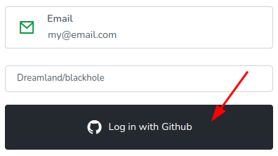
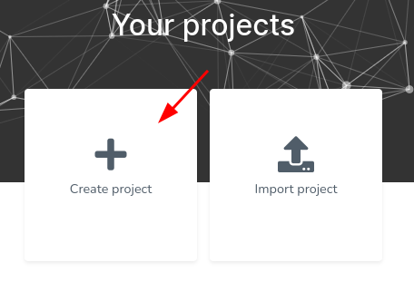
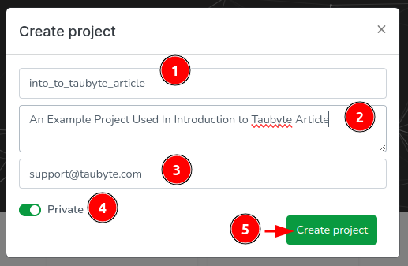

# Projects

<!-- Source: docs-old/01-dev-getting-started/02-first-project.md -->

A project in Taubyte serves as the top-level container for all your resources including functions, websites, databases, storage, and messaging channels. Every resource you create belongs to a project.

## Creating a Project

You can create a project using either the Web Console (recommended for beginners) or the tau-cli (for CLI enthusiasts).

### Using the Web Console

#### 1. Access the Web Console

Navigate to [console.taubyte.com](https://console.taubyte.com) and configure your login:

- Enter your email
- Select network: `Dreamland/blackhole` (for local development)
- Click `Login with GitHub`

> **Note**: GitHub access is browser-local and creates project repositories that are cloned into a browser-based virtual filesystem.

#### 2. Create Your Project

1. From the projects dashboard, click `Create project`

2. Configure your project settings:
   - **Name**: Choose a descriptive project name
   - **Description**: Provide a brief project description
   - **Visibility**: Select private or public for repository visibility

#### 3. Project Structure Created

The Web Console automatically creates two repositories for your project:

- **Config Repository**: Contains YAML configuration files for all resources
- **Code Repository**: Contains source code for functions and libraries

Upon successful creation, you'll be redirected to the project dashboard:

### Using tau-cli

For developers who prefer command-line workflows, check out the [tau-cli documentation](https://github.com/taubyte/tau-cli) for project creation commands.

## Project Structure

Once created, your project has the following organizational structure:

### Global Scope

By default, all resources are created in the global scope and are accessible throughout the project:

- **Functions**: Serverless function definitions
- **Websites**: Static site configurations
- **Databases**: Key-value storage definitions
- **Storage**: Object storage configurations
- **Messaging**: Pub/Sub channel definitions
- **Libraries**: Shared code libraries

### Application Scope

You can organize resources into applications for better management and granular access control. Each application can have its own:

- Dedicated resources with application-specific settings
- Access to both application and global resources
- Isolated configuration and code organization

## Git Integration

Taubyte projects are fundamentally Git-native:

### Repository Structure

- **Configuration changes** are stored as YAML files
- **Code changes** are stored in appropriate language directories
- **Branch-based environments** allow different deployment targets

### Workflow

1. Make changes through Web Console or directly in Git
2. Configuration and code are version controlled
3. Push changes trigger automatic deployments
4. Full audit trail through Git history

## Project Configuration

Projects can be configured with various settings:

### Environment Management

- **Development**: Use local dream instance
- **Staging**: Point to staging branch
- **Production**: Point to main/production branch

### Access Control

- **Repository permissions** control who can modify project
- **Application-level isolation** for team organization
- **Resource-specific access** through application scoping

## Best Practices

### Organization

- Use **applications** to group related functionality
- Keep **global resources** for shared infrastructure
- Use descriptive names for all resources

### Development Workflow

1. **Local Development**: Test with dream before pushing
2. **Feature Branches**: Use Git branches for feature development
3. **Progressive Deployment**: Deploy to staging before production
4. **Configuration Management**: Keep environment-specific configs in separate branches

### Security

- Use **private repositories** for sensitive projects
- Implement **application-level isolation** for multi-tenant scenarios
- Regularly review **access permissions**

## Next Steps

Once you have a project created:

- Create your [first function](functions.md) to handle HTTP requests
- Set up [databases](databases.md) for data storage
- Configure [messaging](messaging.md) for real-time communication
- Organize code with [libraries](libraries.md) for reusability
