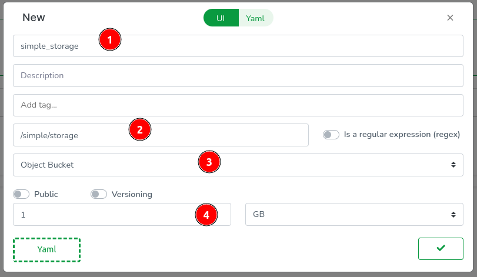

# Storage

Taubyte provides distributed object storage for files, images, documents, and any other binary data. Storage buckets are created on-demand and accessed through a simple file-based interface with automatic replication and global distribution.

## Storage Characteristics

### Object Storage

- **File-based Interface**: Similar to file system operations
- **Binary Safe**: Store any file type (images, videos, documents, etc.)
- **Content Addressing**: Efficient storage with automatic deduplication
- **Streaming Support**: Handle large files without memory overhead

### Dynamic Buckets

- **On-Demand Creation**: Buckets created when first accessed
- **Regex Matchers**: Use patterns for tenant isolation
- **No Pre-provisioning**: Start using storage immediately
- **Flexible Organization**: Organize files using path-like structures

### Global Distribution

- **Automatic Replication**: Files replicated across multiple nodes
- **Content Delivery**: Fast access from anywhere in the world
- **High Availability**: Continues operating despite node failures

## Creating Storage

### Using the Web Console

1. Navigate to `Storage` in the side menu and click the `+` button


2. Configure your storage:
   - **Name**: `simple_storage` (descriptive name)
   - **Matcher**: `/simple/storage` (path pattern for bucket access)
   - **Type**: `Object Bucket` (storage type)
   - **Size**: `1GB` (storage limit)



3. Push the configuration changes


### Storage Configuration

Storage is configured through YAML:

```yaml
id: ""
description: Object storage for files and media
tags: []
matcher: /simple/storage
type: object
size: 1GB
```

#### Configuration Options

**Matcher Patterns:**

- **Simple Path**: `/simple/storage` - Single bucket
- **Regex Pattern**: `/profile/storage/[^/]+` - Bucket per user
- **Wildcard**: `/files/*` - Multiple isolated buckets

**Size Limits:**

- Set appropriate limits based on expected usage
- Can be adjusted later as needs grow
- Supports various units (MB, GB, TB)

## Using Storage

### Basic Operations

#### Creating a Connection

```go
import "github.com/taubyte/go-sdk/storage"

// Open storage bucket (creates if doesn't exist)
bucket, err := storage.New("/simple/storage")
if err != nil {
    return handleError(err)
}
```

#### Storing Files

```go
// Select a file in the bucket
file := bucket.File("example.txt")

// Write data to the file
data := []byte("This is the content of the file.")
_, err = file.Add(data, true) // true = overwrite if exists
if err != nil {
    return handleError(err)
}
```

#### Retrieving Files

```go
// Get file from bucket
file := bucket.File("example.txt")

// Get a reader for the file
reader, err := file.GetFile()
if err != nil {
    return handleError(err)
}
defer reader.Close()

// Read file content
content, err := io.ReadAll(reader)
if err != nil {
    return handleError(err)
}
```

#### Deleting Files

```go
// Delete a file
file := bucket.File("example.txt")
err = file.Delete()
if err != nil {
    return handleError(err)
}
```

## Complete Examples

### File Upload Function

```go
package lib

import (
    "encoding/json"
    "github.com/taubyte/go-sdk/event"
    http "github.com/taubyte/go-sdk/http/event"
    "github.com/taubyte/go-sdk/storage"
)

type UploadRequest struct {
    Filename string `json:"filename"`
    Data     string `json:"data"`
}

func handleError(h http.Event, err error, code int) uint32 {
    h.Write([]byte(err.Error()))
    h.Return(code)
    return 1
}

//export uploadFile
func uploadFile(e event.Event) uint32 {
    h, err := e.HTTP()
    if err != nil {
        return 1
    }

    // Open storage bucket
    bucket, err := storage.New("/simple/storage")
    if err != nil {
        return handleError(h, err, 500)
    }

    // Parse request body
    var req UploadRequest
    decoder := json.NewDecoder(h.Body())
    err = decoder.Decode(&req)
    if err != nil {
        return handleError(h, err, 400)
    }

    // Select file in bucket
    file := bucket.File(req.Filename)

    // Write data to file
    _, err = file.Add([]byte(req.Data), true)
    if err != nil {
        return handleError(h, err, 500)
    }

    // Return success response
    response := map[string]string{
        "message":  "File uploaded successfully",
        "filename": req.Filename,
    }
    responseData, _ := json.Marshal(response)

    h.Headers().Set("Content-Type", "application/json")
    h.Write(responseData)
    h.Return(200)
    return 0
}
```

### File Download Function

```go
//export downloadFile
func downloadFile(e event.Event) uint32 {
    h, err := e.HTTP()
    if err != nil {
        return 1
    }

    // Get filename from query parameter
    filename, err := h.Query().Get("filename")
    if err != nil {
        return handleError(h, err, 400)
    }

    // Open storage bucket
    bucket, err := storage.New("/simple/storage")
    if err != nil {
        return handleError(h, err, 500)
    }

    // Select file in bucket
    file := bucket.File(filename)

    // Get file reader
    reader, err := file.GetFile()
    if err != nil {
        return handleError(h, err, 404)
    }
    defer reader.Close()

    // Stream file content to response
    _, err = io.Copy(h, reader)
    if err != nil {
        return handleError(h, err, 500)
    }

    h.Return(200)
    return 0
}
```

### Image Processing Example

```go
//export processImage
func processImage(e event.Event) uint32 {
    h, err := e.HTTP()
    if err != nil {
        return 1
    }

    // Read uploaded image from request body
    imageData, err := io.ReadAll(h.Body())
    if err != nil {
        return handleError(h, err, 400)
    }

    // Open storage bucket
    bucket, err := storage.New("/images/processed")
    if err != nil {
        return handleError(h, err, 500)
    }

    // Generate unique filename
    filename := fmt.Sprintf("processed_%d.jpg", time.Now().UnixNano())

    // Process image (example: resize, filter, etc.)
    processedData := processImageData(imageData)

    // Store processed image
    file := bucket.File(filename)
    _, err = file.Add(processedData, true)
    if err != nil {
        return handleError(h, err, 500)
    }

    // Return download URL
    downloadURL := fmt.Sprintf("/api/download?filename=%s", filename)
    response := map[string]string{
        "processed_image_url": downloadURL,
        "filename": filename,
    }

    responseData, _ := json.Marshal(response)
    h.Headers().Set("Content-Type", "application/json")
    h.Write(responseData)
    h.Return(200)
    return 0
}
```

## Advanced Patterns

### Multi-Tenant Storage

Use regex matchers for per-user storage:

```yaml
matcher: /user-files/[^/]+
```

```go
// Each user gets their own isolated storage
userID := "user123"
bucket, err := storage.New(fmt.Sprintf("/user-files/%s", userID))
```

### Hierarchical File Organization

Organize files using path-like structures:

```go
// Store files in organized folders
bucket.File("documents/invoice_001.pdf")
bucket.File("images/avatar.jpg")
bucket.File("backups/2024/january/data.zip")
```

### Content Types and Metadata

Handle different file types appropriately:

```go
//export uploadWithMetadata
func uploadWithMetadata(e event.Event) uint32 {
    h, err := e.HTTP()
    if err != nil {
        return 1
    }

    // Get content type from headers
    contentType := h.Headers().Get("Content-Type")

    // Determine file extension based on content type
    extension := getExtensionFromContentType(contentType)

    // Generate filename with proper extension
    filename := fmt.Sprintf("upload_%d%s", time.Now().UnixNano(), extension)

    // Store file with proper naming
    bucket, _ := storage.New("/uploads")
    file := bucket.File(filename)

    // Copy request body directly to file
    _, err = io.Copy(file, h.Body())
    if err != nil {
        return handleError(h, err, 500)
    }

    return 0
}

func getExtensionFromContentType(contentType string) string {
    switch contentType {
    case "image/jpeg":
        return ".jpg"
    case "image/png":
        return ".png"
    case "text/plain":
        return ".txt"
    case "application/pdf":
        return ".pdf"
    default:
        return ".bin"
    }
}
```

### File Streaming for Large Files

Handle large files efficiently:

```go
//export streamLargeFile
func streamLargeFile(e event.Event) uint32 {
    h, err := e.HTTP()
    if err != nil {
        return 1
    }

    bucket, err := storage.New("/large-files")
    if err != nil {
        return handleError(h, err, 500)
    }

    // Generate unique filename
    filename := fmt.Sprintf("large_file_%d.bin", time.Now().UnixNano())
    file := bucket.File(filename)

    // Stream directly from request to storage
    // This avoids loading entire file into memory
    written, err := io.Copy(file, h.Body())
    if err != nil {
        return handleError(h, err, 500)
    }

    response := map[string]interface{}{
        "filename": filename,
        "size": written,
        "message": "Large file uploaded successfully",
    }

    responseData, _ := json.Marshal(response)
    h.Write(responseData)
    h.Return(200)
    return 0
}
```

## File Management Utilities

### Listing Files

```go
//export listFiles
func listFiles(e event.Event) uint32 {
    h, err := e.HTTP()
    if err != nil {
        return 1
    }

    // Get prefix from query (optional)
    prefix, _ := h.Query().Get("prefix")

    bucket, err := storage.New("/simple/storage")
    if err != nil {
        return handleError(h, err, 500)
    }

    // List files with optional prefix
    files, err := bucket.ListFiles(prefix)
    if err != nil {
        return handleError(h, err, 500)
    }

    // Return file list as JSON
    response := map[string]interface{}{
        "files": files,
        "count": len(files),
    }

    responseData, _ := json.Marshal(response)
    h.Headers().Set("Content-Type", "application/json")
    h.Write(responseData)
    h.Return(200)
    return 0
}
```

### File Information

```go
//export fileInfo
func fileInfo(e event.Event) uint32 {
    h, err := e.HTTP()
    if err != nil {
        return 1
    }

    filename, err := h.Query().Get("filename")
    if err != nil {
        return handleError(h, err, 400)
    }

    bucket, err := storage.New("/simple/storage")
    if err != nil {
        return handleError(h, err, 500)
    }

    file := bucket.File(filename)

    // Check if file exists by trying to get its size
    size, err := file.Size()
    if err != nil {
        return handleError(h, err, 404)
    }

    info := map[string]interface{}{
        "filename": filename,
        "size": size,
        "exists": true,
    }

    responseData, _ := json.Marshal(info)
    h.Headers().Set("Content-Type", "application/json")
    h.Write(responseData)
    h.Return(200)
    return 0
}
```

## Best Practices

### Performance

- **Stream large files**: Use io.Copy for files > 10MB
- **Implement caching**: Cache frequently accessed files
- **Optimize file sizes**: Compress where appropriate
- **Use appropriate naming**: Avoid conflicts with good naming schemes

### Security

- **Validate file types**: Check file extensions and content
- **Sanitize filenames**: Prevent path traversal attacks
- **Implement access control**: Restrict who can upload/download
- **Scan for malware**: In production, scan uploaded files

### Organization

- **Use consistent naming**: Establish naming conventions
- **Implement versioning**: For files that change over time
- **Clean up old files**: Implement retention policies
- **Monitor storage usage**: Track and alert on usage patterns

### Error Handling

- **Handle storage limits**: Gracefully handle quota exceeded
- **Implement retries**: For transient network errors
- **Provide meaningful errors**: Help users understand failures
- **Log storage operations**: For debugging and audit trails

## Testing Storage Operations

### Local Testing

```bash
# Upload a file
curl -X POST http://localhost:PORT/api/upload \
  -H "Content-Type: application/json" \
  -d '{"filename": "test.txt", "data": "Hello, World!"}'

# Download a file
curl "http://localhost:PORT/api/download?filename=test.txt"

# List files
curl "http://localhost:PORT/api/files"
```

### Integration Testing

```go
func testStorage() {
    bucket, err := storage.New("/test")
    assert.NoError(err)

    // Test file upload
    file := bucket.File("test.txt")
    _, err = file.Add([]byte("test content"), true)
    assert.NoError(err)

    // Test file download
    reader, err := file.GetFile()
    assert.NoError(err)
    defer reader.Close()

    content, err := io.ReadAll(reader)
    assert.NoError(err)
    assert.Equal("test content", string(content))

    // Test file deletion
    err = file.Delete()
    assert.NoError(err)
}
```

## Troubleshooting

### Common Issues

**File not found errors:**

- Verify filename and path are correct
- Check if file exists using file info functions
- Ensure proper error handling for missing files

**Upload failures:**

- Check storage quota and available space
- Verify file size limits are appropriate
- Ensure proper request formatting

**Performance issues:**

- Use streaming for large files
- Implement caching for frequently accessed content
- Monitor network latency and bandwidth

Storage in Taubyte provides a robust foundation for handling files and binary data in your distributed applications, with automatic scaling, replication, and global distribution built-in.
