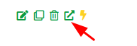

# Websites

<!-- Source: docs-old/01-dev-getting-started/04-first-website.md -->


Now that you know how to create a serverless function, let's create a Website.

### Creating the Website

Navigate to `Websites` in the side menu and click the `+` button.


Input a website name. Ensure the repository is set to `generate`. Toggle `private` if you'd like the repository to be private. Select the generated domain, add `/` as a path, and validate.


Select the HTML template, and click `Generate`.

> **Note**: This will create a new repository on Github and push the generated code to it.

Notice that now you have a new website in the list.


Click on the push button at the bottom right corner to push the configuration changes.


Click on the `websites` folder, then on the YAML file for your new website. Copy `github.id` (903606675 in the example) and `github.fullname` (taubyte0/tb_website_tau_how_new_website in the example); we'll need them later.


Enter a commit message, and click `Push`.


### Editing the Website

Go back to `Websites` and click on the open icon on the right side of your website. This will open the website repository in a new tab.




Click on the `index.html` file to open it.


Click on the `Edit` button to edit the file.


Change the content of the file, and click on the `Commit Changes...` button.


Enter a commit message, and click on the `Commit Changes` button.


### Triggering the Build

Unlike a deployed `tau` cloud, `dream` is not able to trigger the build automatically, so we need to do it manually.

```bash
dream inject push-specific \
--rid 903606675 \
--fn taubyte0/tb_website_tau_how_new_website
```

> **Note**: Use the `github.id` for `--rid` and `github.fullname` for `--fn` you copied earlier.

Navigate to the builds page and wait for the build to complete.


### Opening the Website

First, if not done already while creating a function (see [Creating a function](../getting-started/first-function.md)), add the generated domain to your hosts file. On Unix-like systems (Linux/macOS), edit `/etc/hosts`:

```sh
sudo vi /etc/hosts
```

For me, the generated domain is `gftxhd6h0.blackhole.localtau`. So I add:

```
127.0.0.1 gftxhd6h0.blackhole.localtau
```

Then navigate to the `Websites` page and click on the thunder to open the website in a new tab.


Congratulations! You've successfully created a website!
