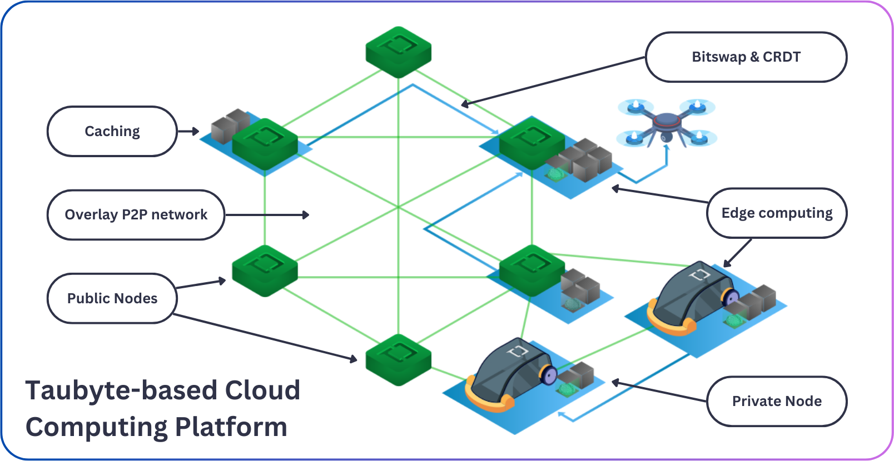

# Architecture

At its core, Taubyte is a distributed peer-to-peer network of nodes providing services that make up the platform. Each node has its own unique identity and can provide one or many services.

## Core Architecture Components

### Discovery & Routing

Within the cloud, nodes advertise services and data to other nodes. The gathered information is stored in a specialized type known as a Kademlia Distributed Hash Table (DHT). This enables the cloud to keep an active directory of nodes and resources without relying on a central service, thereby enhancing the platform's resilience.

However, because of downsides like uneven key distribution and stale entries, we only rely on the DHT for low-level information.

### Transport

The transport layer builds an overlay over TCP offering secure communication, resiliency and efficient usage of the network resources thanks to multiplexing.

### Tunneling

In cases where nodes might be in different networks, public nodes acting as relay will facilitate communication between nodes by establishing dynamic tunnels. This essentially frees you from ever having to deal with VPNs!

### Data Storage

Data is stored in a content-addressed system with automatic deduplication. This means that each piece of data is identified by its content, rather than its location in the network. This approach enhances:

- **Data Integrity**: Content-based addressing ensures data hasn't been tampered with
- **Storage Efficiency**: Automatic deduplication reduces storage overhead
- **Scalability**: Distributed storage scales automatically with the network

A mechanism known as Bitswap is used to exchange data between nodes allowing efficient and fast data transfer.

## Service Architecture

Services are what turn the peer-to-peer network into a cloud computing platform. Taubyte's architecture allows nodes to host multiple services, with the exception of `gateway` and `substrate`. For a cloud to operate optimally, it requires at least one instance of each service, except for `gateway`.

### Service Categories

**Request Handling:**

- `gateway`: L7 load balancer and entry point
- `substrate`: Processes and serves requests
- `seer`: DNS resolution and load balancing

**CI/CD Pipeline:**

- `patrick`: Git event handler → CI/CD pipeline
- `monkey`: CI/CD job executor

**Infrastructure Management:**

- `auth`: Authentication and secrets management
- `tns`: Project registry and configuration store
- `hoarder`: Data replication manager

## Distributed Architecture Benefits

### Resilience

- No single point of failure
- Automatic service discovery
- Self-healing network topology

### Scalability

- Horizontal scaling by adding nodes
- Load distribution across the network
- Automatic resource management

### Security

- End-to-end encryption
- Node identity verification
- Content integrity verification
- Isolated execution environments

### Flexibility

- Branch-based environments
- Dynamic service allocation
- Configurable node shapes

## Production vs Development

### Production Architecture

In production, nodes can run multiple services by defining a "shape". This allows for efficient resource utilization and reduces the number of required nodes.

### Development Architecture

In development (using `dream`), each node typically runs a single service. This single-service-per-node setup is purely for development convenience and easier debugging.

## Network Communication

All communication between nodes is:

- **Encrypted**: Ensures data privacy and security
- **Authenticated**: Verifies node identity
- **Multiplexed**: Efficient use of network connections
- **Resilient**: Automatic failover and reconnection

This architecture enables Taubyte to provide a truly distributed cloud platform that scales globally while maintaining security and performance.
