# Your First Function

In this guide, we'll create a project and deploy your first WebAssembly serverless function using the Web Console.

## Step 1: Create a Project

First, we need to create a project to host our function.

### Configure Web Console Access

1. Navigate to [console.taubyte.com](https://console.taubyte.com)
2. Configure your login:
   - Enter your email
   - Select network: `Dreamland/blackhole`
   - Click `Login with GitHub`

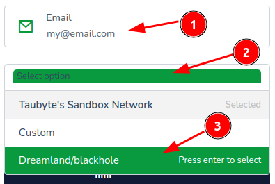
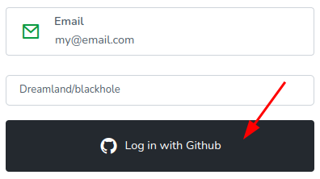

> 💡 **Note**: The GitHub access is browser-local and is used to create project repositories that will be cloned into a browser-based virtual filesystem.

### Create Your Project

1. From the projects dashboard, click `Create project`

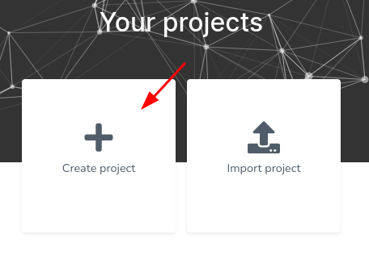

2. Configure your project:
   - Name: your-project-name
   - Description: A brief description
   - Visibility: private or public if you want open repositories

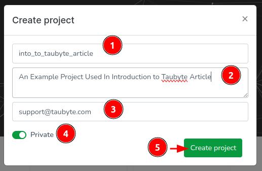

### What Happens Behind the Scenes

The Web Console will create two repositories:

- **Config Repository**: Contains YAML configuration files
- **Code Repository**: Contains inline source code in various languages

Upon successful creation, you'll be redirected to the project dashboard:

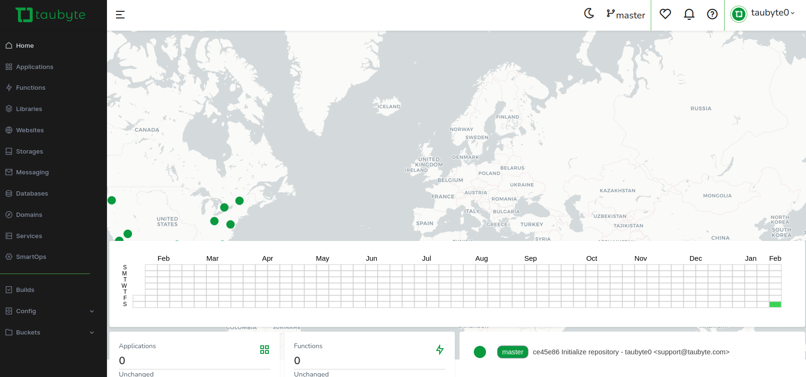

## Step 2: Create a Function

Now let's create a WebAssembly serverless function in Go.

### Create the Function

1. Navigate to `Functions` in the side menu and click the `+` button

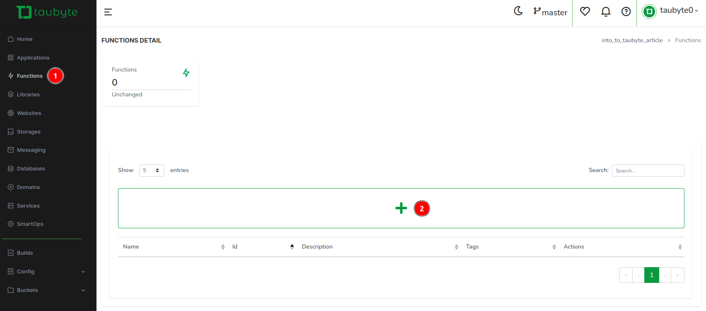

2. Instead of filling out fields manually, let's use a template. Click `Template Select`

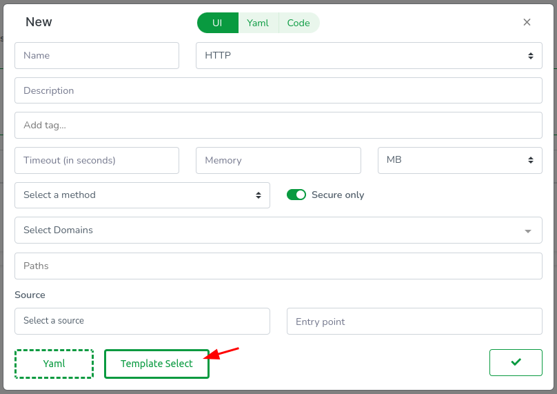

3. In the template modal: Select Go as the language, choose the `ping_pong` template, and click 'Close' to exit the modal

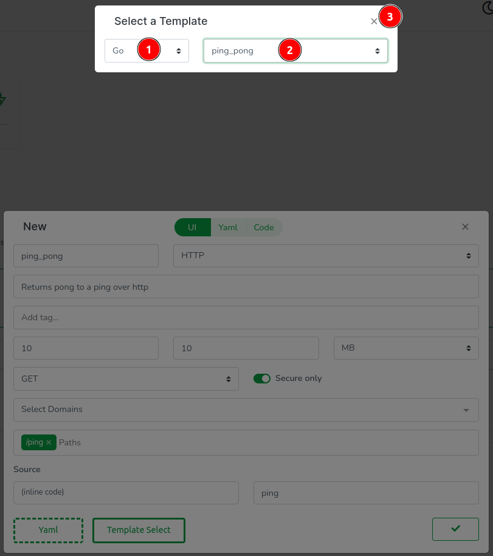

4. The template fills most fields automatically. For domains, click the dropdown and select `GeneratedDomain` to create a new domain resource

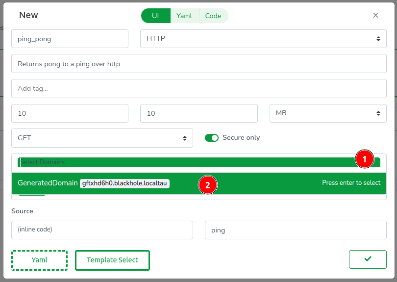

### Understanding the Configuration

The Web Console clones your repos in-browser, so everything has a code representation. Click the `Yaml` tab to see the function's config:

```yaml
id: ""
description: Returns pong to a ping over HTTP
tags: []
source: .
trigger:
  type: https
  method: GET
  paths:
    - /ping
domains:
  - GeneratedDomain
execution:
  timeout: 10s
  memory: 10MB
  call: ping
```

**Key Configuration Notes:**

- `source: .` points to inline code, but you can also reference Git repos using `source: github.com/username/repo`
- The `trigger` section supports multiple paths and HTTP methods - useful for RESTful APIs
- Memory and timeout values can use any standard unit (KB, MB, GB, ms, s, m)
- The `call` field must match your exported WebAssembly function name

### Examine the Code

Next, let's inspect the code. Click on the `Code` tab to access the Web Console's code editor.

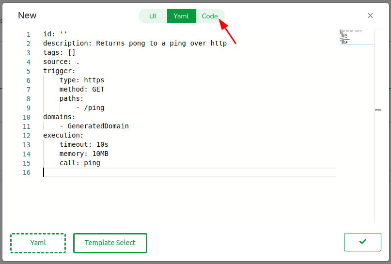

In the editor, you will observe:

1. The usual Go files including go.mod
2. The code for our handler function `ping`
3. A `.taubyte` folder defining how the function is built

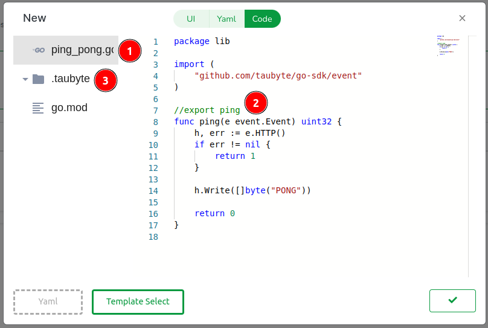

**Important Code Requirements:**

- **Package Naming**: The `main` package name is reserved for the build container. Use a descriptive package name for your function
- **SDK Implementation**: `github.com/taubyte/go-sdk` provides the interface between your code and the VM with optimized wrappers
- **TinyGo Compilation**: Functions must be exported using `//export functionName` syntax
- **Event Architecture**: Events use minimal memory with uint32 identifiers, designed for efficient serverless execution

Click `Done` to proceed.

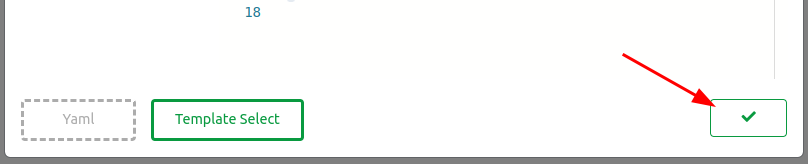

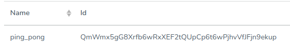

## Step 3: Deploy the Function

Everything done so far is confined to a virtual filesystem in your browser. To apply these changes, we need to push them.

### Push Configuration Changes

1. Find the green button at the bottom right of the screen and click on it

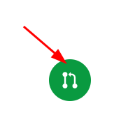

2. A modal will guide you through the code changes. Click on the domains folder, then open the GeneratedDomain.yaml file

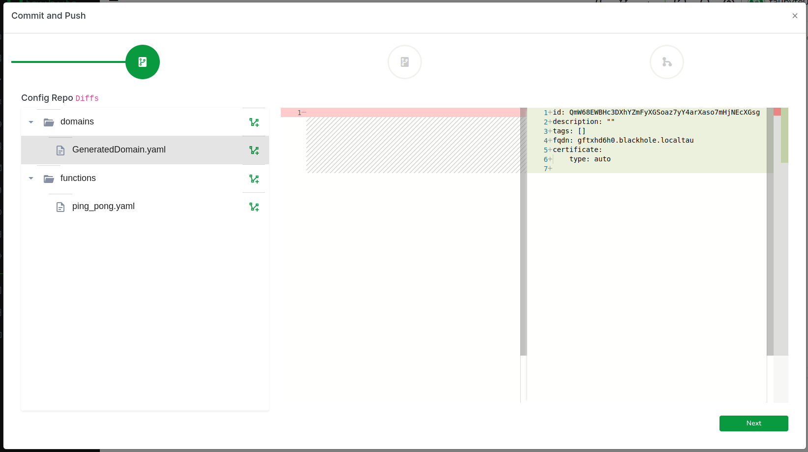

3. **Important**: Copy the FQDN generated for you as we will need it later:

```yaml
fqdn: gftxhd6h0.blackhole.localtau
```

4. Click on Next to review code changes

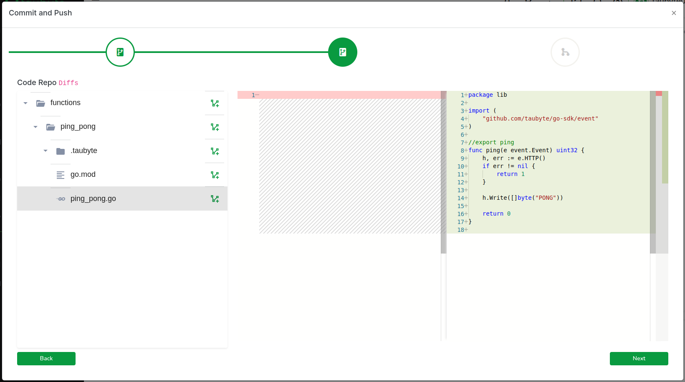

5. Enter a commit message and push the changes to GitHub

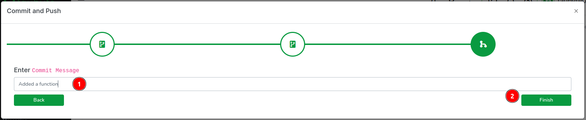

### Trigger Build

In production, this push would trigger an event that your cloud would capture. However, because we're using `dream` and GitHub cannot reach your nodes directly, we run a fixture called `push-all` to emulate the git events. Switch back to your terminal and run:

```sh
dream inject push-all
```

### Monitor Build Progress

Return to the Web Console and, on the side menu, click on `Builds`. You should see two CI/CD jobs, one for configuration and one for code.

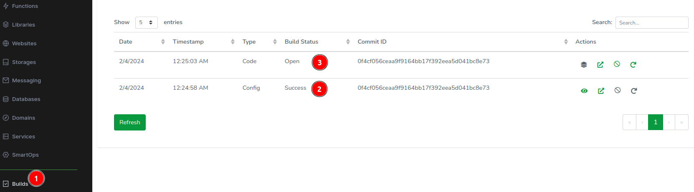

After a few seconds, the build should complete. Click on `Refresh` if it seems delayed. Then, click on the stack icon to view the ping_pong function.

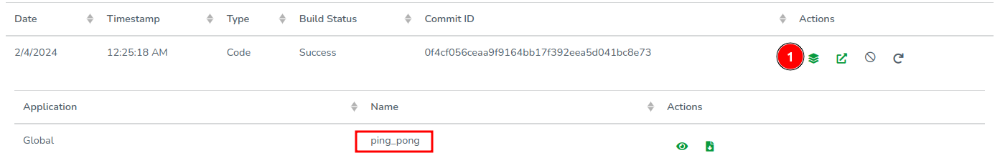

## Step 4: Test Your Function

Now that our function is ready, let's test it!

### Find the Substrate Port

Since we're running locally, we need to find the right port to send requests to. The `substrate` node handles HTTP traffic:

```sh
dream status substrate
```

Example output showing HTTP port 14529:

```
┌─────────────────────┬────────┬───────┐
│ substrate@blackhole │ copies │     1 │
│                     ├────────┼───────┤
│                     │ dns    │ 14304 │
│                     ├────────┼───────┤
│                     │ http   │ 14529 │
│                     ├────────┼───────┤
│                     │ p2p    │ 14282 │
└─────────────────────┴────────┴───────┘
```

### Test with curl

Test the function using `curl`, making sure to replace `gftxhd6h0.blackhole.localtau` with your own generated domain:

```sh
curl -H "Host: gftxhd6h0.blackhole.localtau" http://127.0.0.1:14529/ping
```

Output:

```
PONG
```

### Optional: Add to Hosts File

For a smoother development experience, you can add the generated domain to your hosts file. On Unix-like systems (Linux/macOS), edit `/etc/hosts`:

```sh
sudo vi /etc/hosts
```

Add your generated domain:

```
127.0.0.1 gftxhd6h0.blackhole.localtau
```

Save and exit, then run `curl` again without the `Host` header:

```sh
curl http://gftxhd6h0.blackhole.localtau:14529/ping
```

### Test Through Web Console

If you've added the generated domain to your `/etc/hosts`, you can also test the function directly through the Web Console:

1. In the sidebar, click on `Functions`
2. Find your `ping` function in the list
3. Click the thunder ⚡️ icon next to it to execute

This will open a new tab and make a request to your function's endpoint.

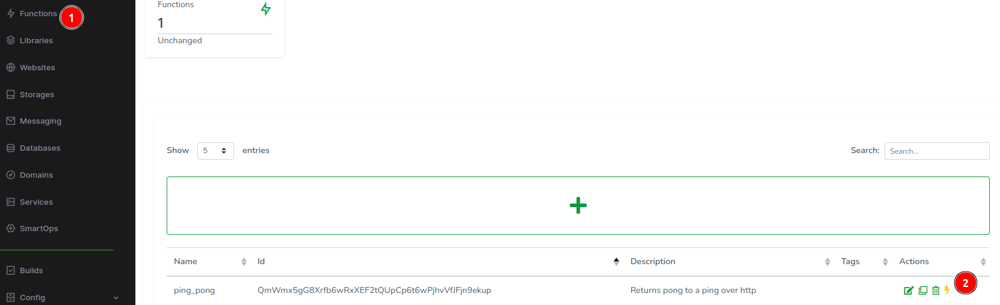
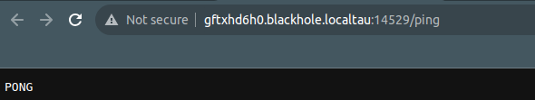
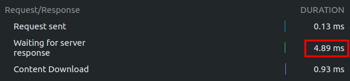

## Congratulations!

You've successfully created a local cloud and executed a serverless function on it!

## Troubleshooting Tips

- If the curl command fails, ensure your port number matches the `dream status substrate` output
- The Host header is only needed if you haven't added the domain to `/etc/hosts`
- If the function build fails, check the Builds tab for detailed error messages
- The `dream inject push-all` command might need to be run again if changes aren't reflecting

## Next Steps

Now that you have a working function, you can:

- Learn more about [Functions](../development/functions.md) in the development section
- Explore [Websites](../development/websites.md) hosting
- Try [Databases](../development/databases.md) for data storage
- Understand the [Architecture](../fundamentals/architecture.md) behind Taubyte
