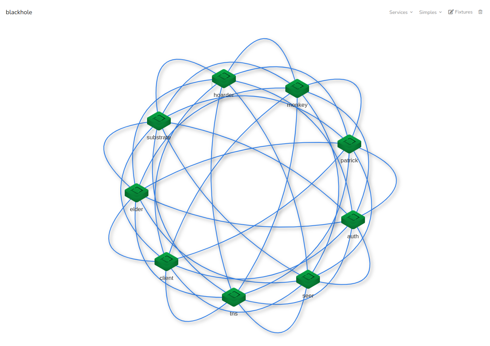
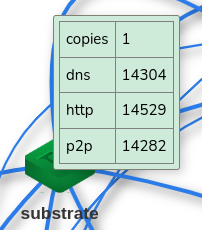

# Start a Local Cloud

<!-- Source: https://tau.how/getting-started/local-cloud/ -->

Let's dive right in and get our hands dirty with some real cloud development! We'll use `dream` to spin up your own Taubyte cloud right on your local machine.

## Quick Start

Start your local cloud environment:

```sh
dream new multiverse    # Creates and starts a new cloud instance
```

You should see:

```sh
[INFO] Dreamland ready
[SUCCESS] Universe blackhole started!
```

> **Tip**: You can verify everything is running with `dream status universe`

Once you see `SUCCESS`, it means your cloud has been fully started.

## Verify Your Cloud

Let's check the status of our cloud environment:

```sh
dream status universe
```

Example output:

```
┌───────┬─────────────────────┬────────┬───────┐
│ Nodes │ elder@blackhole     │ p2p    │ 14051 │
│       ├─────────────────────┼────────┼───────┤
│       │ tns@blackhole       │ http   │ 14466 │
...
```

### Understanding the Output:

- **Node Types**:
  - Protocol nodes: Run specific services (e.g., `tns`, `substrate`)
  - Role-based nodes: Handle specific functions (e.g., `elder` for bootstrapping)
- **Universe**: `@blackhole` suffix indicates the cloud instance
- **Ports**: Right column shows TCP ports for each service

## Visual Interface

1. Open [console.taubyte.com](https://console.taubyte.com)
2. Click the Dreamland button (requires active dreamland instance)
3. Navigate: Sidebar → Network → blackhole



The network visualization shows:

- All active nodes from your CLI output
- Interactive node graph
- Port information on hover



> **Tip**: The graph is interactive - drag nodes to rearrange the visualization

## Network Architecture

Your local cloud runs as a peer-to-peer mesh network where each node handles a specific service. While production nodes can run multiple services, dream assigns one service per node for easier debugging.

### Core Services

**Request Handling:**

- `gateway`: L7 load balancer and entry point
- `substrate`: Processes and serves requests
- `seer`: DNS resolution and load balancing

**CI/CD:**

- `patrick`: Git event handler → CI/CD pipeline
- `monkey`: CI/CD job executor

**Infrastructure:**

- `auth`: Authentication and secrets management
- `tns`: Project registry and configuration store
- `hoarder`: Data replication manager

The other nodes, referred to as Simples (admittedly, not the best name), include `elder` and `client`. While they are not crucial for basic operations, they serve important roles:

- `elder` nodes are used for bootstrapping. Since `dream` interconnects all nodes, an `elder` is included for testing purposes when using [dream as a library](https://github.com/taubyte/tau/tree/main/dream)
- `client` nodes are lightweight and can be used to test services or peer-to-peer services deployed on the cloud

> **Note**: In production, nodes can run multiple services by defining a "shape". The single-service-per-node setup in dream is purely for development convenience.

## Next Steps

Now that your local cloud is running, continue to [First Function](first-function.md) to create and deploy your first serverless function.
