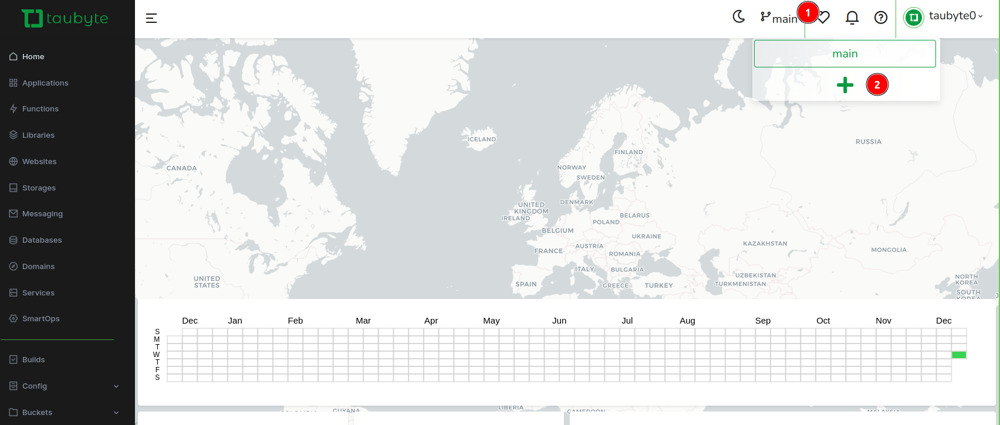
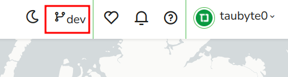

# Working with Branches

<!-- Source: Branch-based environments documentation -->

Taubyte's Git-native architecture makes working with branches a powerful way to manage different environments and feature development. Both `tau` (production) and `dream` (development) support running on specific Git branches, enabling branch-based environments.

## Branch-Based Environments

### Concept

Each Taubyte cloud can be configured to track a specific Git branch:

- **Production Cloud**: Typically tracks `main` or `master` branch
- **Staging Cloud**: Often tracks `staging` or `release` branch
- **Development Cloud**: Can track `develop` or feature branches
- **Feature Environments**: Track specific feature branches

### Benefits

- **Isolated Testing**: Test features without affecting production
- **Environment Parity**: Same codebase across all environments
- **Safe Deployment**: Promote changes through environments via Git merges
- **Rollback Capability**: Easy rollbacks by switching branches

## Setting Up Branch Environments

### Production Environment (Tau)

Configure production nodes to track the main branch:

```yaml
# /etc/tau/config.yaml
git:
  branch: main
  auto_pull: true
  poll_interval: 30s
```

### Development Environment (Dream)

Start dream on a specific branch:

```bash
# Start dream on development branch
dream new multiverse -b develop

# Start dream on feature branch
dream new multiverse -b feature/new-api

# Default (main branch)
dream new multiverse
```

Verify the branch:

```bash
dream status universe
```

## Branch Workflow Example

### 1. Create Development Branch

Using the Web Console:

1. Navigate to your project
2. Click on the current branch name (usually "main")
3. Click the `+` button to create a new branch



4. Enter branch name (e.g., "develop") and validate


5. Console refreshes and shows the new branch is active



### 2. Start Dream on New Branch

```bash
# Start dream targeting the new branch
dream new multiverse -b develop
```

### 3. Test Build Process

```bash
# Trigger builds for the development branch
dream inject push-all
```

If the branch doesn't exist remotely, you'll see an error like:

```
Running job failed with error:
Checkout develop failed with: reference not found
```

This means the branch needs to be created in the remote repository first (step 1 above).

## Common Branch Workflows

### Git Flow Workflow

```bash
# Main branches
main        # Production-ready code
develop     # Integration branch for features

# Supporting branches
feature/*   # Feature development
release/*   # Release preparation
hotfix/*    # Production hotfixes
```

#### Environment Mapping

```bash
# Production cloud tracks main
tau --branch main

# Staging cloud tracks release branches
tau --branch release/v1.2.0

# Development cloud tracks develop
dream new multiverse -b develop

# Feature testing
dream new multiverse -b feature/user-auth
```

### GitHub Flow Workflow

```bash
# Simple workflow
main          # Production-ready code
feature/*     # All feature development
```

#### Environment Mapping

```bash
# Production
tau --branch main

# Feature development and testing
dream new multiverse -b feature/payment-integration
```

### Environment-Specific Branches

```bash
# Environment branches
production    # Production environment
staging       # Staging environment
development   # Development environment
```

## Branch Management Commands

### Dream Branch Operations

```bash
# Check current branch
dream status universe

# Switch to different branch (requires restart)
dream stop
dream new multiverse -b new-branch

# List available branches
dream branch list

# Create new branch environment
dream new multiverse -b feature/new-feature
```

### Manual Git Operations

For direct repository management:

```bash
# Clone project repositories
git clone <config-repo-url>
git clone <code-repo-url>

# Create and switch to new branch
git checkout -b feature/new-api

# Push new branch to remote
git push -u origin feature/new-api

# Merge to main (production deployment)
git checkout main
git merge feature/new-api
git push origin main
```

## Configuration Management Across Branches

### Environment-Specific Configurations

Different branches can have different configurations:

#### Development Branch Configuration

```yaml
# config/functions/api.yaml (develop branch)
memory: 50MB
timeout: 30s
domains:
  - dev.myapp.com
environment:
  - API_LEVEL: debug
  - LOG_LEVEL: trace
```

#### Production Branch Configuration

```yaml
# config/functions/api.yaml (main branch)
memory: 100MB
timeout: 10s
domains:
  - api.myapp.com
  - www.myapp.com
environment:
  - API_LEVEL: info
  - LOG_LEVEL: warn
```

### Database Configurations

Separate databases per environment:

```yaml
# Development database
matcher: /dev/userdata
size: 100MB
replication:
  min: 1
  max: 1
```

```yaml
# Production database
matcher: /prod/userdata
size: 10GB
replication:
  min: 2
  max: 3
```

## Deployment Strategies

### Feature Branch Testing

1. **Create Feature Branch**

   ```bash
   git checkout -b feature/user-profiles
   ```

2. **Start Development Environment**

   ```bash
   dream new multiverse -b feature/user-profiles
   ```

3. **Develop and Test**

   - Make changes through Web Console or locally
   - Test with `dream inject push-all`
   - Iterate until feature is complete

4. **Merge to Development**

   ```bash
   git checkout develop
   git merge feature/user-profiles
   ```

5. **Promote to Production**
   ```bash
   git checkout main
   git merge develop
   ```

### Hotfix Workflow

1. **Create Hotfix Branch from Production**

   ```bash
   git checkout main
   git checkout -b hotfix/security-patch
   ```

2. **Test Hotfix**

   ```bash
   dream new multiverse -b hotfix/security-patch
   # Test the fix
   ```

3. **Deploy to Production**

   ```bash
   git checkout main
   git merge hotfix/security-patch
   git push origin main
   ```

4. **Merge Back to Development**
   ```bash
   git checkout develop
   git merge hotfix/security-patch
   ```

### Continuous Deployment

Set up automatic deployments based on branch:

```yaml
# .github/workflows/deploy.yml
on:
  push:
    branches:
      - main # Deploy to production
      - develop # Deploy to staging
      - feature/* # Deploy to feature environments
```

## Testing Across Branches

### Parallel Testing

Run multiple dream instances for different branches:

```bash
# Terminal 1: Main branch testing
dream new multiverse -b main --name main-env

# Terminal 2: Feature branch testing
dream new multiverse -b feature/api-v2 --name feature-env

# Terminal 3: Development branch
dream new multiverse -b develop --name dev-env
```

### Integration Testing

```bash
# Test integration between branches
dream new multiverse -b integration-test

# Pull changes from multiple feature branches
git merge origin/feature/frontend
git merge origin/feature/backend

# Test combined functionality
dream inject push-all
```

## Monitoring Branch Environments

### Environment Status

```bash
# Check which branch each environment tracks
dream status universe
tau status --config /etc/tau/config.yaml

# View recent deployments per branch
tau deploy list --branch develop
tau deploy list --branch main
```

### Build Status Across Branches

Monitor builds for different branches:

```bash
# Development builds
dream build status --branch develop

# Production builds
tau build status --branch main

# Feature branch builds
dream build status --branch feature/new-ui
```

## Best Practices

### Branch Naming

- **Use descriptive names**: `feature/user-authentication` vs `feature1`
- **Follow conventions**: Stick to team naming conventions
- **Include ticket numbers**: `feature/JIRA-123-payment-integration`
- **Use separators**: Forward slashes for categorization

### Environment Management

- **Clean up branches**: Delete merged feature branches
- **Limit concurrent branches**: Don't run too many environments simultaneously
- **Resource allocation**: Consider resource usage across multiple environments
- **Monitoring**: Monitor all environments, not just production

### Security Considerations

- **Separate secrets**: Use different secrets per environment
- **Access control**: Limit who can deploy to production branches
- **Data isolation**: Ensure development doesn't access production data
- **Network isolation**: Separate network access per environment

### Performance

- **Resource sharing**: Share resources between similar environments when possible
- **Cleanup policies**: Automatically clean up old feature environments
- **Monitoring**: Track resource usage across all branch environments

Branch-based development in Taubyte provides powerful environment management capabilities while maintaining the simplicity and Git-native approach that makes Taubyte unique.
