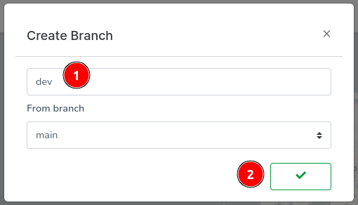

# Working with Branches

<!-- Source: docs-old/01-dev-getting-started/11-work-with-branches.md -->


The best practice is to create a new branch for each feature or bugfix. This way, you can work on your feature or bugfix in isolation and merge it into the main branch when it's ready. Both tau and dream support running on branches. Here we'll assume tau is running on the main & master branches, which is the default. And we will explore how to run dream on a development branch.

### Dream on a branch
First start dream on the branch you want to work on. Here `dev` is the branch name.

```bash
dream new multiverse -b dev
```

Then connect to your dream universe, sould be `blackhole`, through web console and create or import a project. If your not sure how to accomplish this, please refer to [Creating a project](02-first-project.md).

Now, try to trigger a build:
```bash
dream inject push-all
```

On dream logs you'll see an error that looks like this:
```
Running job `QmR5fg8CTdzzzKdi7EF46CPzcZZ5SBdLuVTdbyJ6H2KC3k` failed with error: running job for type: 2 on repo: 905437146 failed with: new git repo failed with: Checkout dev failed with: reference not found
```

This is because the branch `dev` does not exist on the remote repository.


Let's fix that. On the top right corner, click on the current branch name, should be 'main', then click on `+`.


Type `dev` as branch name then validate.



The console will refresh and you'll see the branch name changed to `dev`.


Now if you try to trigger a build again, it should succeed.
```bash
dream inject push-all
```

If you imported a new project, and let's say you had a function there it'll be built. If on the other hand you created a new project you can refer to [Functions](03-first-function.md) to learn how to create a function, then test it.
