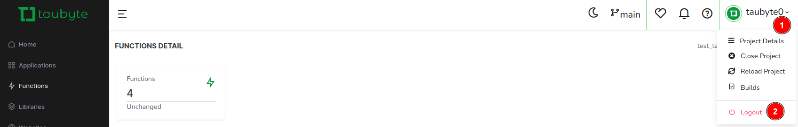
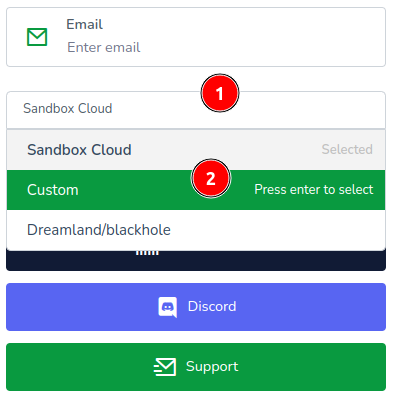
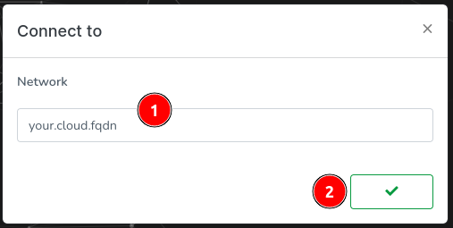
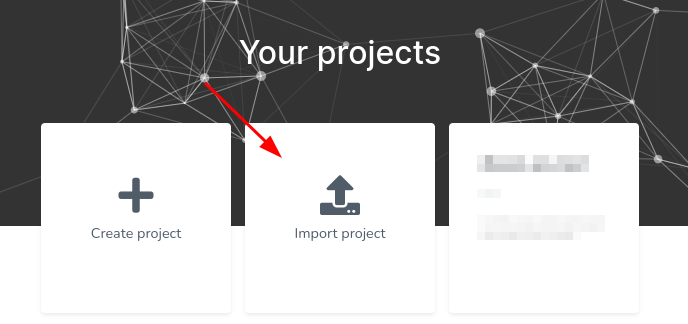
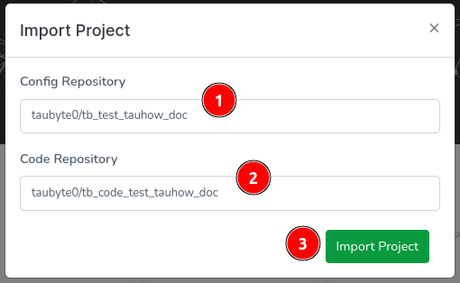
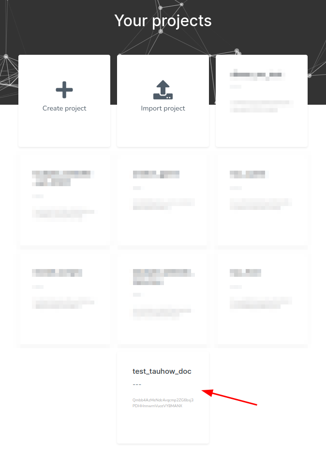

# Going to Production

<!-- Source: Production deployment guidelines -->

With Taubyte, going to production is a straightforward process. The platform's Git-native approach means your local development environment closely matches production, making the transition smooth and predictable.

## Production Readiness Overview

### Prerequisites

Before going to production, ensure you have:

1. **Production Infrastructure**: Deployed Taubyte cloud (manual or Spore Drive)
2. **Domain Configuration**: DNS properly configured with SSL certificates
3. **Tested Application**: Thoroughly tested in development environment
4. **Access Setup**: Web Console or tau-cli configured for production cloud

## Production Deployment Methods

### Method 1: Project Import (Recommended)

Import your existing project into the production cloud.

#### Step 1: Access Production Cloud

If you're currently connected to dream (development), log out first:



Navigate to [console.taubyte.com](https://console.taubyte.com) and select "Custom":



Enter your production cloud's FQDN and login:



#### Step 2: Import Your Project

Click "Import Project":



Select the repositories to import. The Web Console will:

- Identify eligible repositories automatically
- Match code repositories with config repositories
- Allow manual entry if repositories aren't detected



Your project appears in the project list. Click to load it:



#### Step 3: Trigger Production Builds

Depending on your development workflow:

**If you developed on the main branch:**

1. Push changes to config repository
2. Push changes to code repository
3. Push changes to any library repositories
4. Builds trigger automatically

**If you developed on a feature branch:**

1. Merge your feature branch into main
2. Push merged changes to trigger builds
3. Monitor build progress in Web Console

### Method 2: Branch Promotion

Promote code through environments using Git branches.

#### Development → Staging → Production

```bash
# 1. Merge feature to development
git checkout develop
git merge feature/my-feature
git push origin develop

# 2. Deploy to staging environment (tracks develop branch)
# Staging cloud automatically builds from develop branch

# 3. After testing, promote to production
git checkout main
git merge develop
git push origin main

# 4. Production cloud automatically builds from main branch
```

### Method 3: Direct Deployment

Deploy directly to production (use with caution).

```bash
# 1. Ensure you're on the correct branch
git checkout main

# 2. Push directly to production branch
git push origin main

# 3. Monitor deployment in production Web Console
```

## Production Configuration

### Environment-Specific Settings

Production configurations often differ from development:

#### Domain Configuration

**Development:**

```yaml
domains:
  - dev.myapp.com
  - *.dev.myapp.com
```

**Production:**

```yaml
domains:
  - myapp.com
  - www.myapp.com
  - api.myapp.com
```

#### Resource Allocation

**Development:**

```yaml
# function config
memory: 10MB
timeout: 30s
```

**Production:**

```yaml
# function config
memory: 100MB
timeout: 10s
```

#### Database Configuration

**Development:**

```yaml
# database config
matcher: /dev/userdata
size: 100MB
replication:
  min: 1
  max: 1
```

**Production:**

```yaml
# database config
matcher: /prod/userdata
size: 10GB
replication:
  min: 2
  max: 3
```

### Environment Variables

Use environment-specific variables:

```yaml
# Development
environment:
  variables:
    - API_ENDPOINT: https://api-dev.myapp.com
    - LOG_LEVEL: debug
    - CACHE_TTL: "60"

# Production
environment:
  variables:
    - API_ENDPOINT: https://api.myapp.com
    - LOG_LEVEL: warn
    - CACHE_TTL: "3600"
```

## Deployment Verification

### Health Checks

After deployment, verify your application:

#### Function Testing

```bash
# Test critical endpoints
curl -I https://api.myapp.com/health
curl -I https://api.myapp.com/version

# Test with sample data
curl -X POST https://api.myapp.com/api/users \
  -H "Content-Type: application/json" \
  -d '{"name": "test", "email": "test@example.com"}'
```

#### Website Testing

```bash
# Test website availability
curl -I https://myapp.com
curl -I https://www.myapp.com

# Test specific pages
curl -I https://myapp.com/about
curl -I https://myapp.com/contact
```

#### Database Testing

```bash
# Test database operations (through API)
curl https://api.myapp.com/api/users
curl -X POST https://api.myapp.com/api/data \
  -d '{"key": "test", "value": "production-test"}'
```

### Performance Monitoring

Monitor key metrics post-deployment:

#### Response Times

```bash
# Measure response times
curl -w "@curl-format.txt" -o /dev/null https://api.myapp.com/health

# curl-format.txt contents:
#      time_namelookup:  %{time_namelookup}\n
#         time_connect:  %{time_connect}\n
#      time_appconnect:  %{time_appconnect}\n
#     time_pretransfer:  %{time_pretransfer}\n
#        time_redirect:  %{time_redirect}\n
#   time_starttransfer:  %{time_starttransfer}\n
#                      ----------\n
#           time_total:  %{time_total}\n
```

#### Load Testing

```bash
# Simple load test with curl
for i in {1..100}; do
  curl -s https://api.myapp.com/health > /dev/null &
done
wait

# Using ab (Apache Bench)
ab -n 1000 -c 10 https://api.myapp.com/health

# Using wrk
wrk -t12 -c400 -d30s https://api.myapp.com/health
```

## Production Best Practices

### Security

#### HTTPS Configuration

Ensure all traffic uses HTTPS:

```yaml
# Force HTTPS redirects
https:
  redirect: true
  hsts: true

# Certificate management
tls:
  auto_cert: true
  cert_email: admin@myapp.com
```

#### Access Control

```yaml
# Restrict admin endpoints
paths:
  - path: /admin/*
    auth_required: true

# Rate limiting
rate_limit:
  enabled: true
  requests_per_minute: 100
```

### Monitoring and Logging

#### Application Monitoring

Set up monitoring for:

- Response times and availability
- Error rates and types
- Resource usage (CPU, memory)
- Request volume and patterns

#### Log Management

```yaml
# Production logging configuration
logging:
  level: warn
  format: json
  output: /var/log/tau/application.log

# Log rotation
log_rotation:
  enabled: true
  max_size: 100MB
  max_files: 10
```

### Performance Optimization

#### Caching Strategy

```yaml
# Cache configuration
cache:
  enabled: true
  ttl: 3600
  max_size: 1GB
```

#### CDN Integration

Configure CDN for static assets:

```yaml
# Static asset configuration
static_assets:
  cdn_url: https://cdn.myapp.com
  cache_control: "public, max-age=31536000"
```

### Backup and Recovery

#### Database Backups

```bash
# Automated backup script
#!/bin/bash
DATE=$(date +%Y%m%d_%H%M%S)
tau backup database --project myapp --output backup_${DATE}.tar.gz

# Upload to secure storage
aws s3 cp backup_${DATE}.tar.gz s3://myapp-backups/
```

#### Configuration Backups

```bash
# Backup project configuration
git clone https://github.com/myuser/myapp-config.git
cd myapp-config
git tag production-$(date +%Y%m%d_%H%M%S)
git push --tags
```

## Rollback Procedures

### Quick Rollback

If issues arise, quickly rollback:

#### Method 1: Git Revert

```bash
# Revert to previous commit
git revert HEAD
git push origin main

# Production cloud automatically builds reverted version
```

#### Method 2: Tag Rollback

```bash
# Rollback to specific tag
git checkout v1.2.3
git push origin main --force

# Or create rollback branch
git checkout -b rollback-to-v1.2.3 v1.2.3
git push origin rollback-to-v1.2.3

# Then merge rollback branch
git checkout main
git merge rollback-to-v1.2.3
git push origin main
```

### Gradual Rollback

For more controlled rollbacks:

1. **Traffic Splitting**: Route percentage of traffic to previous version
2. **Feature Flags**: Disable problematic features
3. **Database Migration**: Rollback database changes if needed

## Maintenance and Updates

### Regular Maintenance

#### Platform Updates

```bash
# Update Taubyte platform (coordinate with team)
tau update --version latest

# Verify update
tau version
tau health check
```

#### Dependency Updates

```bash
# Update application dependencies
cd project-repo
npm update
go mod tidy

# Test updates in development first
dream new multiverse -b main
dream inject push-all

# Deploy to production after testing
git commit -am "Update dependencies"
git push origin main
```

### Monitoring Production Health

#### Automated Health Checks

```bash
#!/bin/bash
# production-health-check.sh

# Check main endpoints
endpoints=("https://myapp.com" "https://api.myapp.com/health")

for endpoint in "${endpoints[@]}"; do
  status=$(curl -s -o /dev/null -w "%{http_code}" "$endpoint")
  if [ "$status" != "200" ]; then
    echo "ERROR: $endpoint returned $status"
    # Send alert (email, Slack, etc.)
  else
    echo "OK: $endpoint"
  fi
done
```

#### Performance Monitoring

```bash
# Monitor key metrics
tau metrics --project myapp --period 24h
tau logs --project myapp --level error --since 1h
```

## Troubleshooting Production Issues

### Common Issues

#### Build Failures

```bash
# Check build logs
tau build logs --project myapp --latest

# Retry failed build
tau build retry --project myapp --build-id <id>
```

#### Performance Issues

```bash
# Check resource usage
tau metrics cpu --project myapp
tau metrics memory --project myapp

# Scale resources if needed
tau scale --project myapp --function api --memory 200MB
```

#### Connectivity Issues

```bash
# Test network connectivity
tau ping --cloud production
tau dns check myapp.com

# Check certificate status
tau cert status myapp.com
```

Going to production with Taubyte is designed to be as smooth as possible, with the Git-native approach ensuring that your local development environment closely matches production behavior.
