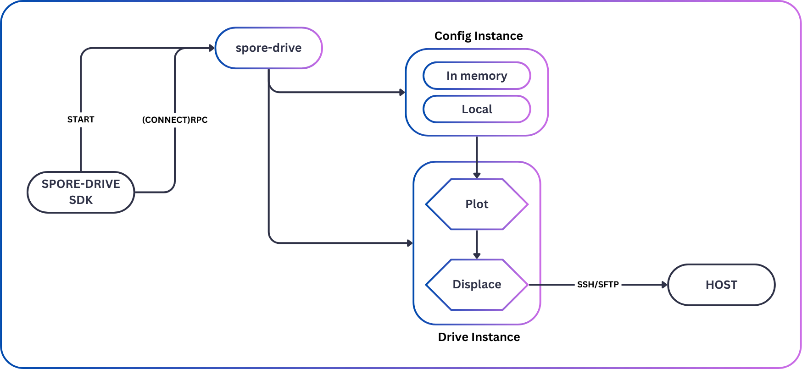

# Spore Drive - Automated Deployment

<!-- Source: docs-old/02-platform-getting-started/11-spore-drive.md -->

While [manually deploying a Tau cloud](deployment.md) gives you complete control over the setup process, automating this deployment can save significant time and reduce potential configuration errors. This is where Spore Drive comes in - a developer-friendly tool that automates cloud deployment with just a few lines of code.

### Why Spore Drive?

While existing Infrastructure as Code (IaC) solutions could be used to deploy Tau, they often come with:

- Complex configuration languages to learn
- Steep learning curves
- Heavy dependencies and prerequisites
- Unnecessary features that add complexity

Spore Drive was created to align with Taubyte's philosophy of simplification. It provides:

- A minimal, intuitive API that feels natural to developers
- Just the features needed for Tau deployment
- Agentless deployment using only SSH
- Simple configuration through code

By focusing on simplicity and automation, Spore Drive lets you spend less time wrestling with infrastructure and more time building.

### Language Support

While this guide uses TypeScript, Spore Drive is designed to be language-agnostic with:

- Native Go support (core implementation)
- TypeScript/JavaScript client
- More clients coming soon (Python, Rust, etc.)

### How it works

Spore drive is an RPC service that runs on your local machine. Unless used from browser, your SDK will start it for you.



When your create a new configuration, spore-drive will create an instance of it either fully in memory if you don't provide a path or an in memory COW (Copy On Write) backed by a the file system. That allows multiple clients to manipulate the same configuration without having to worry about consistency. Only when you commit configuration changes, spore-drive will write the changes to the file system.

When you create a new drive, it takes a refrence to the configuration instance. When plot a course, a necessary step before deployment, spore-drive will create a plan of action to deploy tau.

Finally, when you call `displace`, spore drive, since it's agent-less, will use SSH to connect to your hosts and execute the deployment.

### Getting Started with TypeScript

Let's create a new project:

```sh
$ npm init -y
$ npm install typescript tsx --save-dev
$ npx tsc --init
```

Configure TypeScript in `tsconfig.json`:

```json
{
  "compilerOptions": {
    "target": "ES2020",
    "module": "ESNext",
    "moduleResolution": "node",
    "declaration": true,
    "outDir": "dist",
    "rootDir": ".",
    "strict": true,
    "esModuleInterop": true,
    "resolveJsonModule": true,
    "skipLibCheck": true,
    "lib": ["ES2020"]
  },
  "include": ["src/**/*.ts"],
  "exclude": ["node_modules"]
}
```

Add the run script to `package.json`:

```json
"scripts": {
    "displace": "tsx src/index.ts"
},
```

Install Spore Drive:

```sh
$ npm install @taubyte/spore-drive
```

### Writing the Deployment Code

Create `src/index.ts`:

```ts
import {
  Config,
  CourseConfig,
  Drive,
  TauLatest,
  Course,
} from "@taubyte/spore-drive";
```

Initialize configuration:

```ts
const config: Config = new Config(`${__dirname}/../config`);
await config.init();
```

> **Note**: If you ommit the path to configuration, it'll be stored in memory. Storing the `config` locally, especially in a git repository, is best practice.

Configure your cloud (similar to the manual setup in the previous guide):

```ts
export const createConfig = async (config: Config) => {
  // Set root domain (like enterprise.starships.ws from the manual guide)
  const domain = config.Cloud().Domain();
  await domain.Root().Set("enterprise.starships.ws");
  await domain.Generated().Set("e.ftll.ink");

  // Generate required keys (domain validation and swarm)
  await domain.Validation().Generate();
  await config.Cloud().P2P().Swarm().Generate();
```

Followed by configuring SSH access:
=== "Using password auth"

    ```ts
    // Configure SSH access
    const mainAuth = config.Auth().Signer("main");
    await mainAuth.Username().Set("root");
    await mainAuth.Password().Set(process.env.HOST_PASSWORD!);
    ```

=== "Using key auth"

    ```ts
    // Configure SSH access
    const mainAuth = config.Auth().Signer("main");
    await mainAuth.Username().Set("root");
    await mainAuth.Key().Data().Set(await fs.promises.readFile(process.env.HOST_KEY!));
    ```

Then define your shapes. Here we're defining a `compute` shape.

```ts
  // Define services (similar to manual configuration)
  const all = config.Shapes().Shape("compute");
  await all.Services().Set([
    "auth", "tns", "hoarder", "seer",
    "substrate", "patrick", "monkey"
  ]);
  await all.Ports().Port("main").Set(BigInt(4242));
  await all.Ports().Port("lite").Set(BigInt(4247));
}
```

Define your hosts list:

```ts
// Define your hosts list with required fields
const yourHostsList = [
  {
    ip: "1.2.3.4",
    id: "node-1",
    location: {
      lat: 40.076897,
      long: -109.33771,
    },
  },
  {
    ip: "5.6.7.8",
    id: "node-2",
    location: {
      lat: 34.052235,
      long: -118.243683,
    },
  },
];
```

> **Note**: If you'd like an example of fetching hosts from a cloud provider, check out the [digitalocean-displacement](https://github.com/taubyte/digitalocean-displacement/tree/main) repository.

Add hosts (automatically configures what you'd manually set up):

```ts
const bootstrapers = [];

for (const host of yourHostsList) {
  const hostname = `host-${host.id}-enterprise-starships`;
  if (!hosts.includes(hostname)) {
    const hostConfig = config.Hosts().Host(hostname);
    bootstrapers.push(hostname);
    await hostConfig.Addresses().Add([`${host.ip}/32`]);
    await hostConfig.SSH().Address().Set(`${host.ip}:22`);
    await hostConfig.SSH().Auth().Add(["main"]);
    await hostConfig.Location().Set(host.location);
    if (!(await hostConfig.Shapes().List()).includes("compute"))
      await hostConfig.Shapes().Shape("compute").Instance().Generate();
  }
}

await config
  .Cloud()
  .P2P()
  .Bootstrap()
  .Shape("compute")
  .Nodes()
  .Add(bootstrapers);
await config.Commit();
```

### Deploying Your Cloud

Create and initialize the Drive:

```ts
const drive: Drive = new Drive(config, TauLatest);
await drive.init();

// Plot the deployment course
const course = await drive.plot(new CourseConfig(["compute"]));
```

Start deployment:

```ts
// Start deployment
await course.displace();

// Monitor progress
for await (const progress of await course.progress()) {
  console.log(`${progress.path}: ${progress.progress}%`);
}
```

### Full Example

For a complete working example, check out our [step-by-step tutorial](https://dev.to/samyfodil/build-your-cloud-2nmm) that walks through deploying a Tau cloud on DigitalOcean using Spore Drive.
